# Final project — Home automation (FPGA DE10-Lite)

This repository documents the Final project using the DE10-Lite development board (MAX 10 10M50DAF484C7G).
The goal of this work is to design a Home Automation and Security System integrating a temperature sensor, an LCD display, a gas/smoke detector, an ultrasonic proximity sensor, and a UART interface used to simulate a locking mechanism and password verification.
 
<!-- Table of content -->
<nav>
  <h1>Table of Contents</h1>
  <ul>
    <li><a href="#Objective">Objective</a></li>
    <li><a href="#Design">Design and Logic</a></li>
    <li><a href="#Implementation">Implementation</a></li>
    <li><a href="#Demonstration">Demonstration </a></li>
    <li><a href="#Conclusions">Conclusions</a></li>
    <li><a href="#Future">Future Improvements</a></li>
  </ul>
</nav>

<h2 id="Objective">Objective</h2>
The objective of this project is to integrate multiple hardware components into a functional Home Automation System controlled entirely by an FPGA. The design combines knowledge learned from all previous labs: UART communication, display control, debouncing, PWM, digital sensors, FSM design and Verilog modular programming.

The system incorporates:

- A 1602A LCD Display (initially planned)
- A DS18B20 Temperature Sensor
- A HC-SR04 Ultrasonic Sensor
- A MQ-2 Gas/Smoke Sensor
- An LC234X UART Interface
- Internal 7-segment displays and LEDR for feedback

<h2 id="Design">Design, Logic and Functionalities</h2>
The system is fully controlled through a Finite State Machine (FSM) and several peripheral Verilog modules dedicated to each sensor. Each functionality is described below.

- Fire detection: The fire alarm subsystem is implemented using the MQ-2 Gas Sensor from Sunfounder. The MQ-2 detects a variety of gases (smoke, methane, LPG, hydrogen), but it does not classify them, it simply activates an output signal. The module operates at 5V, so a voltage divider is required to safely interface the digital output with the FPGA’s 3.3V input. It provides an AO (Analog Output): proportional to gas concentration (not used in this project do to the need of an external ADC module), and a DO (Digital Output): HIGH when gas concentration exceeds threshold (Detection threshold can be adjusted using the onboard potentiometer). Also, for safety purposes, the sensor remains active at all times regardless of system state.
For this project, when gas is detected, the system immediately transitions to the Fire state and displays a warning message. The DO output goes LOW when detection occurs due to the module’s active-low logic.

- Light dimming (Presence detection): This feature uses the HC-SR04 Ultrasonic Sensor to detect proximity and dim LEDs based on the measured distance. The operation cylce is based on the FPGA sending a 10us trigger pulse and the sensor response with an echo pulse, representing the distance. The duration of this echo signal is translated to distance using the formula D = us / 58. A voltage divider is also required for the 5V echo output. This feature is only activated when the systme is unlocked. 

- Locking / unlocking (UART Password System): The locking system uses UART to simulate user interaction from a PC terminal (RealTerm). When in IDLE (Unlocked) state, pressing a pushbutton initiates a 5-second countdown before the system locks. To unlock the system, the user must send a correct password over UART. If the password is incorrect, the system enters a Wrong Password state adn a 3-second timer forces the user to retry.

- Intruder detection:  When the system is locked, any close-range presence detected using the HC-SR04 triggers the Intruder state. The user must provide a password over UART to return to the IDLE state. The purpose is to simulate a simple home alarm or motion-triggered alert system.

- Display system: Initially, the goal was to display temperature and messages on the 1602A LCD, but due to time constraints, the system uses the DE10-Lite’s built-in 7-segment displays and LEDRs. In case of Fire detection, the word "Fire" blinks on the 7-segment display. When locking the system, the word "locking" blinks and after the 5 seconds, the word remains steady. In case of intruder the word "robber" can be seen. And when entering the password, each character is also visible. When IDLE state is active, the temperature was ment to be seen both in Farenheid and Celsius.

- Voltage devider: Because the HC-SR04 and MQ-2 work at 5V, a voltage divider is required. A 5 kΩ on top and a 3.3 kΩ on bottom.

*Figure 1.1 — Block diagram design*

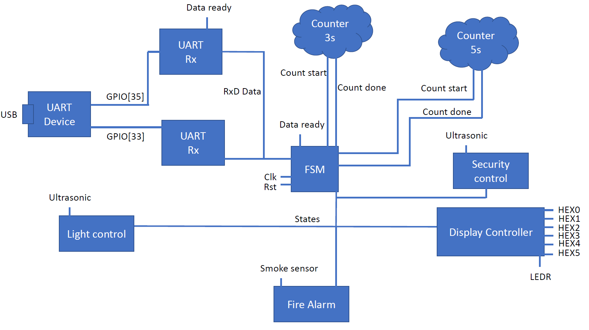

*Figure 1.2 — States diagram design*

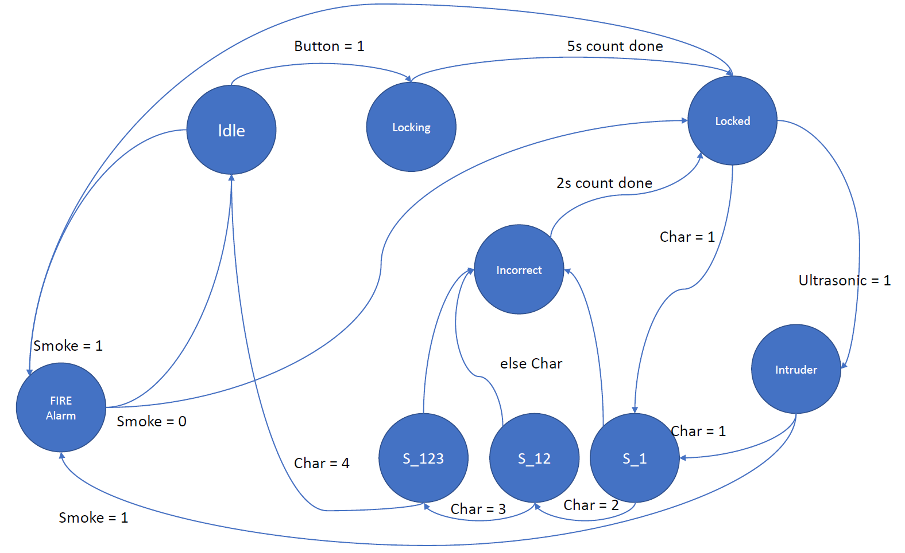

<h2 id="Implementation">Implementation</h2>
This section explains the key modules and internal logic used in the project. The full code is available in the Code/ folder.

- Ultrasonic Detector:
As explained on the design, a signal needs to be triggerd for 10 us in a cycle of 60ms. For the signal detection, a simple FSM is implemented to effitiently measure the raising and falling edges and determine the precise distance of the object.

*Figure 1.3 — Trigger signal Ultrasonic module*

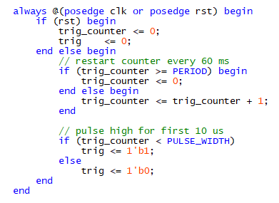

*Figure 1.4 — Echo signal Ultrasonic module*

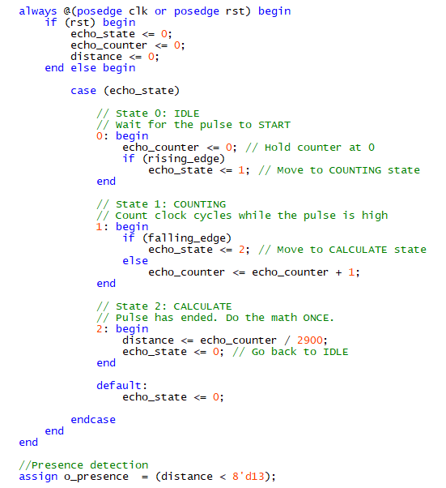

- PWM for light dimming:
Using the frequency of the signal, the human eye can interprete the brightness of the light. It creates a pulsing signal depending on the proximity with a distance-to-duty mapping. Then the one bit signal is concatenated for the ten bits of the LEDR.

*Figure 1.5 — PWM light module*

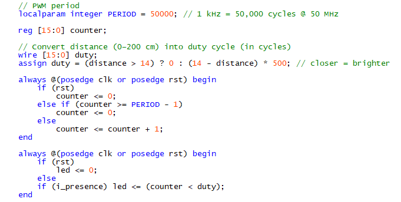

*Figure 1.6 — PWM light RTL Viewer*

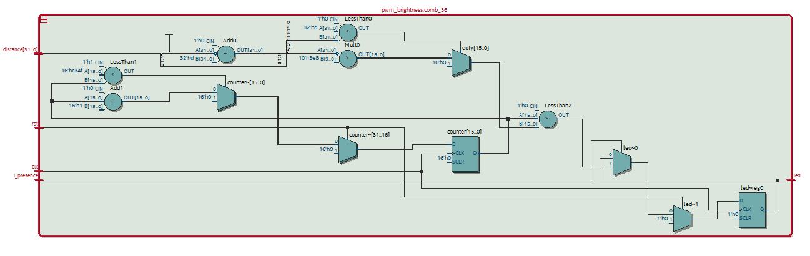

- Main FSM
The FSM manages transitions between all security and automation states.

State      | Input condition            | Next state    | Actions / outputs
-----------|--------------------------- |---------------|--------------------------------
S_IDLE     | Fire = 0                   | S_Fire        | Display Fire
S_Fire     | Fire = 1                   | S_Locked      | Display locked
S_IDLE     | Lock = 1                   | S_Locking     | Display locked blinking
S_Locking  | Count done                 | S_Locked      | Display locked
S_Locked   | Presence                   | S_Intruder    | Display intruder
S_Intruder | Password                   | S_PW          | Display character
S_Password | Wrong character            | S_wrong_PW    | Display worng password
S_wrong_PW | Count done                 | S_Locked      | Display locked
S_Password | Correct password           | S_IDLE        | Display temperature

*Figure 1.7 — States diagram RTL Viewer*

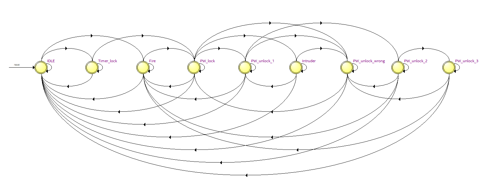

- Display controller
The display controller modules is an always statement that determine with priorities the message to show. The order would be determine of the safety requiremetns:
Fire → Locking → Password → Intruder → Wrong PW → Locked → Temperature (C and F)

Timings, debouncing and UART modules from previous labs were reused.

*Figure 1.8 — Main block diagram RTL Viewer*

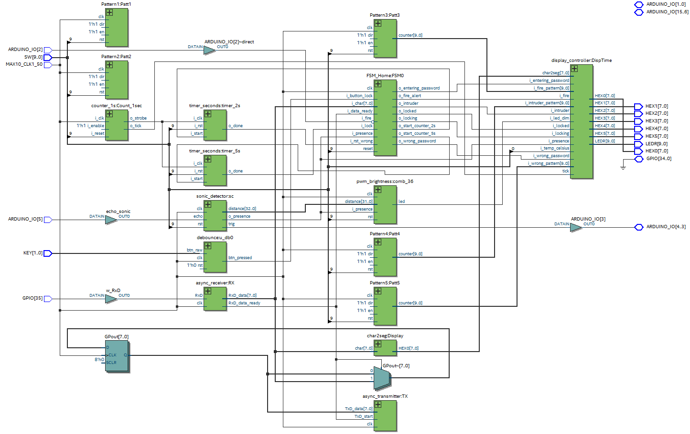

<h2 id="Demonstration">Demonstration</h2>

*Figure 1.9 — Locking implementation*

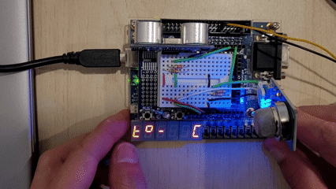

*Figure 1.10 — Temperature implementation*

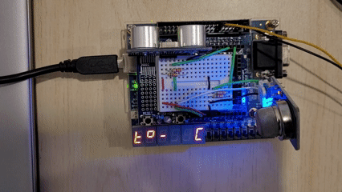

*Figure 1.11 — Intruder implementation*

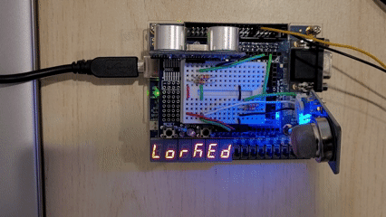

*Figure 1.12 — Password implementation*

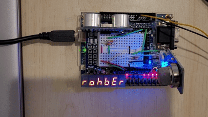

*Figure 1.13 — Fire implementation*

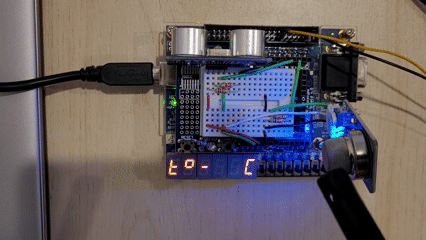

<h2 id="Conclusions">Conclusions</h2>
This project was an opportunity to integrate multiple digital sensors and modules into a larger, real-time system. Although not all initial objectives were completed due to time constraints (LCD and DS18B20), the final implementation demonstrates:
- A fully operational security and automation FSM
- Reliable UART communication
- PWM control for dimming
- Ultrasonic presence detection
- Smoke detection with emergency handling

This project helped consolidate concepts like modular Verilog design, synchronous logic, clock domain management and FSM construction. More time would have allowed code cleanup, more comments, and full integration of the temperature and LCD modules.

<h2 id="Future">Future improvements</h2>
Possible improvements include:
- Full integration of the DS18B20 temperature sensor and LCD display
- Adding an ADC module to read the MQ-2 analog signal for finer smoke-level measurement
- Integrating Bluetooth or Wi-Fi modules for remote monitoring
- Designing a 3D-printed enclosure to better package the system and simulate a real home-security device
- Adding more sensors (PIR, light sensor, humidity sensor)

