# Lab 2 — Numbers and Displays (FPGA DE10-Lite)

This repository documents the second FPGA lab using the DE10-Lite (MAX 10 10M50DAF484C7G).  
The goal is to designing combinational circuits that can perform binary-to-decimal number conversion and binary-coded-decimal (BCD) addition.

<!-- Table of content -->
<nav>
  <h1>Table of Contents</h2>
  <ul>
    <li><a href="#Part I">Part I</a></li>
    <li><a href="#Part II">Part II</a></li>
    <li><a href="#Part III">Part III</a></li>
    <li><a href="#Part IV">Part IV</a></li>
    <li><a href="#Part V">Part V</a></li>
    <li><a href="#Part VI">Part VI</a></li>
    <li><a href="#Part VII">(extra) Part VII</a></li>
  </ul>
</nav>

<!-- Sections -->
<h2 id="Part I">Part I — Display 4-bit values from switches [0..9]</h2>  

### Objective
Display the value from the switches in binary. The circuit will display digits for 0 to 9 and the valuations form 1010 to 1111's as don't cares.

### Logic / Design
A module is created as a 7 segment decoder to display the digits 0 to 9. With a 4-bit input the digits displayed correspond to the input in binary.

Figure 1.1 — 7-segment decoder Design

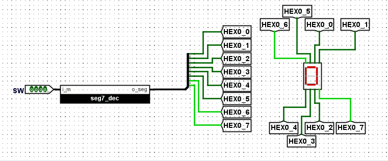

To define the logic, a Look Up Table (LUT) is needed. The 7 segment displays are NOT active in high, whenever are required to be off, will be set to 1.

Figure 1.2 — 7-segment LUT

| Input (i_m[3..0]) | Output (o_seg[7..0]) | Note |
|-------------------|----------------------|------|
| 0000              | 11000000             | 0    |
| 0001              | 11111001             | 1    |
| 0010              | 10100100             | 2    |
| 0011              | 10110000             | 3    |
| 0100              | 10011001             | 4    |
| 0101              | 10010010             | 5    |
| 0110              | 10000010             | 6    |
| 0111              | 11111000             | 7    |
| 1000              | 10000000             | 8    |
| 1001              | 10010000             | 9    |
| 1010              | 1-------             | -    |
| 1011              | 1-------             | -    |
| 1100              | 1-------             | -    |
| 1101              | 1-------             | -    |
| 1110              | 1-------             | -    |
| 1111              | 1-------             | -    |

### Implementation

*Figure 1.3 — 7-segment decoder Implementation*

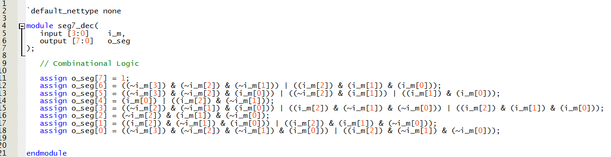

*Figure 1.4 — Main block Implementation*

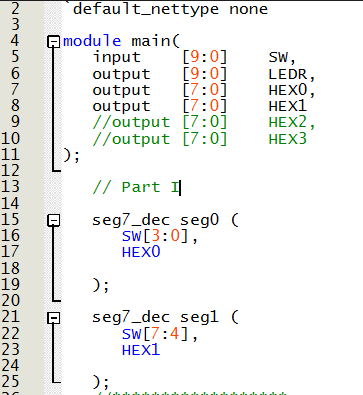

### Demonstration

*Figure 1.5 — 7-segment decoder Demonstration*

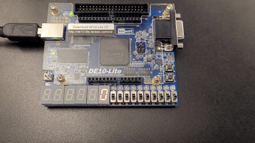

<h2 id="Part II">Part II — Display 4-bit values from switches [0..15]</h2>  

### Objective
Display the values from the switches in binary. The circuit will display digits for 0 to 15 using a convination of two 7-segments display.

### Logic / Design
Using the module 7-segment decoder of the previous part a comparison needs to be made to extract an auxiliary signal to activate the second display for the values highers that 9. 

Figure 2.1 — Comparison module LUT

| Input (i_v[3..0]) | Output (o_z) |
|-------------------|--------------|
| 0000              | 0            |
| 0001              | 0            |
| 0010              | 0            |
| 0011              | 0            |
| 0100              | 0            |
| 0101              | 0            |
| 0110              | 0            |
| 0111              | 0            |
| 1000              | 0            |
| 1001              | 0            |
| 1010              | 1            |
| 1011              | 1            |
| 1100              | 1            |
| 1101              | 1            |
| 1110              | 1            |
| 1111              | 1            |

In paralel of the comparison, a first block named 'Circuit A' converts the binary number signal to extract the first figit of the number. The logic would be than when the number is 10, the first diplay would show the first digit beeng 0. And consequently, 11-->1, 12-->2, etc.

Figure 2.2 — Circuit A module LUT

| Input (i_v[3..0]) | Output (o_a[3..0]) |
|-------------------|--------------------|
| 0000              | 0000               |
| 0001              | 0001               |
| 0010              | 0010               |
| 0011              | 0011               |
| 0100              | 0100               |
| 0101              | 0101               |
| 0110              | 0110               |
| 0111              | 0111               |
| 1000              | 1000               |
| 1001              | 1001               |
| 1010              | 0000               |
| 1011              | 0001               |
| 1100              | 0010               |
| 1101              | 0011               |
| 1110              | 0100               |
| 1111              | 0101               |

With the output signal of the comparison block, another moduled named 'Circuit B' will determine when to display the second digit of the input, in this cas a '1'.

Figure 2.3 — Circuit B module LUT

| Input (i_z) | Output (o_seg[7..0]) |
|-------------|----------------------|
| 0           | 11111111             |
| 0           | 11111001             |

Using four 2-to-1 1bit multiplexeres (from previous Lab) the signal will be toggled to display correctly the first digit of the signal using the 7-segment display module from previous parts.

*Figure 2.4 — Binary to decimal module Design*

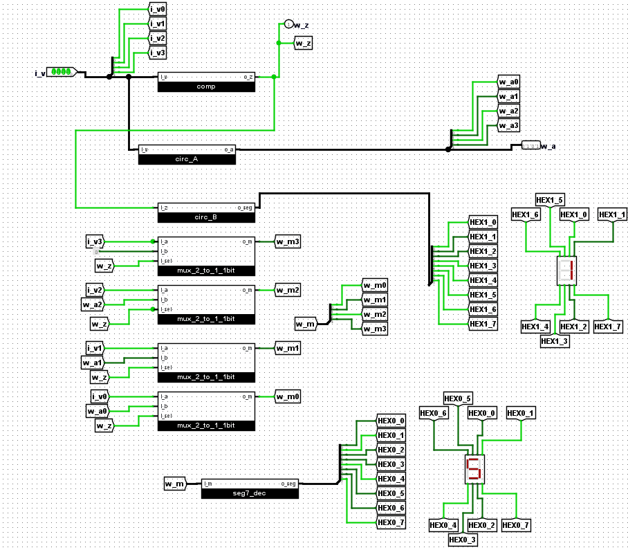

### Implementation

*Figure 2.5 — Circuit A module Implementation*

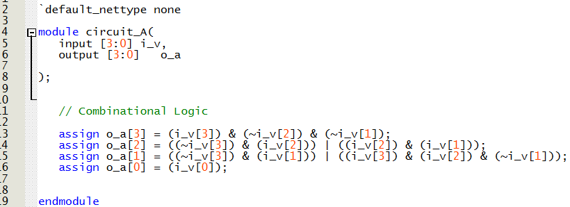

*Figure 2.6 — Circuit B module Implementation*

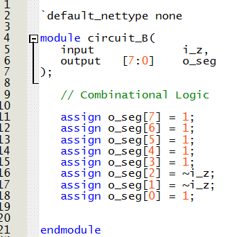

*Figure 2.7 — Comparison module Implementation*

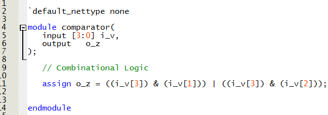

*Figure 2.8 — Binary to decimal module Implementation*

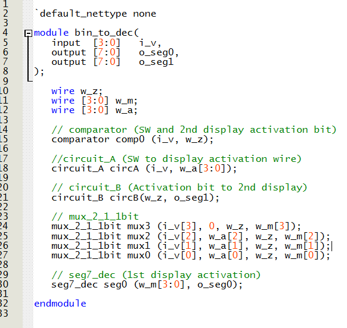

*Figure 2.9 — Main module Implementation*

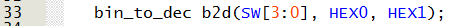

### Demonstration

*Figure 2.10 — Binary to decimal Demonstration*

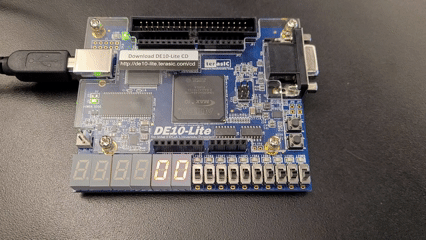

<h2 id="Part III">Part III — Full adder and 4-bit Ripple-carry adder</h2>  

### Objective
Add two binary numbers and a carry-in, and display the result in the LEDs.

### Logic / Design
A full adder module needs to be created, adding two bits and a carry in. It will output two bits, the carry out and the  that will be displayed in the LEDs at first.

Figure 3.1 — FA module LUT

| Input (i_a, i_b, i_c) | Output (o_c, o_s) |
|-----------------------|-------------------|
| 0       0       0     | 0       0         |
| 0       0       1     | 0       1         |
| 0       1       0     | 0       1         |
| 0       1       1     | 1       0         |
| 1       0       0     | 0       1         |
| 1       0       1     | 1       0         |
| 1       1       0     | 1       0         |
| 1       1       1     | 1       1         |

With four of this FA module a 4-bit ripple-carry will be made connecting the carry out of each module to the carry-in of the next one. The uotput will be four bits plus the carry-out.

*Figure 3.2 — 4-bit adder (ripple-carry) Design*

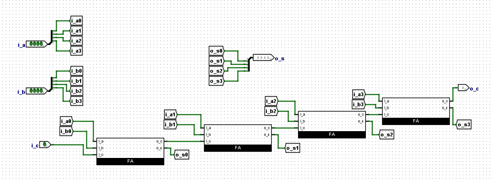

### Implementation

*Figure 3.3 — FA module Implementation*

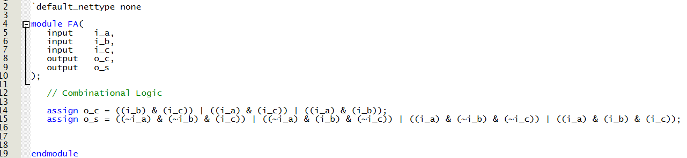

*Figure 3.4 — 4-bit adder (ripple-carry) module Implementation*

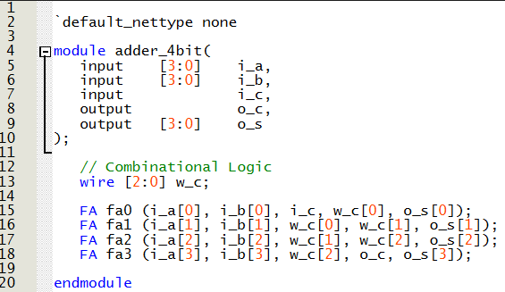

*Figure 3.5 — Main module Implementation*

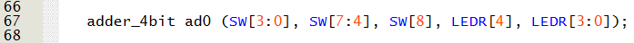

### Demonstration

*Figure 3.6 — FA Demonstration*

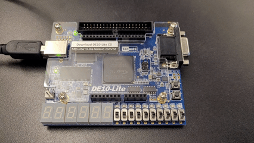

*Figure 3.7 — 4-bit adder (ripple-carry) Demonstration*

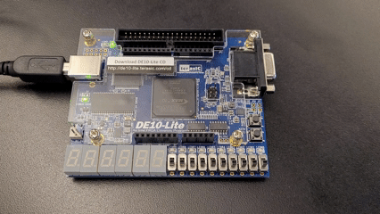

<h2 id="Part IV">Part IV — 8-bit Ripple-carry adder</h2>  

### Objective
Add two decimal numbers (8 bits each) and a carry-in, and display numbers and the result in the LEDs.

### Logic / Design
The logic from previous parts can be used but adapted. A third 'circuit C' module is created into the previous binary to decimal module to contemplate the numbers highers than 15 when a carry-in is active. Coverting them into the first digit for the display. For example 16 to 6 up to 19. In essence, adding 6.

Figure 4.1 — Circuit C module LUT

|Input (i_a, i_cin) | Output (o_a) |
|-------------------|--------------|
| 0000      0       |   0000       |   
| 0000      1       |   0110       |   
| 0001      0       |   0001       |   
| 0001      1       |   0111       |   
| 0010      0       |   0010       |
| 0010      1       |   1000       |
| 0011      0       |   0011       |
| 0011      1       |   1001       |
| 0100      0       |   0100       |
| 0100      1       |   0110       |
| 0101      0       |   0101       |
| 0101      1       |   0111       |
| 0110      0       |   0110       |
| 0110      1       |   1100       |
| 0111      0       |   0111       |
| 0111      1       |   1101       |
| 1000      0       |   1000       |
| 1000      1       |   1110       |
| 1001      0       |   1001       |
| 1001      1       |   1111       |
| 1010      0       |   1010       |
| 1010      1       |   1000       |
| 1011      0       |   1011       |
| 1011      1       |   1001       |
| 1100      0       |   1100       |
| 1100      1       |   1110       |
| 1101      0       |   1101       |
| 1101      1       |   1111       |
| 1110      0       |   1110       |
| 1110      1       |   1100       |
| 1111      0       |   1111       |
| 1111      1       |   1101       |   

For the check binary functionality, a new module is created to verify if the input values are higher than 9, using the module 'comparison' from previous parts. And inlcuding OR gates to implement the carry-in bit into the multiplexers, the module to convert binary to decimal now includes up to 19.

*Figure 4.2 — Binary to decimal module Design*

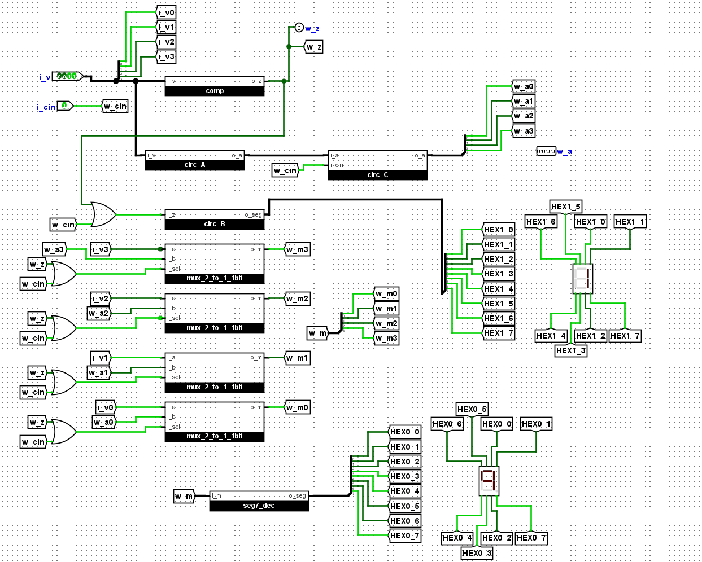

### Implementation

*Figure 4.3 — Circuit C module Implementation*

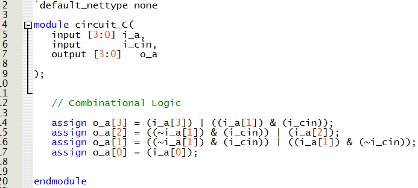

*Figure 4.4 — Check BCD module Implementation*

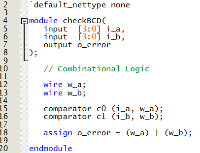

*Figure 4.5 — Binary to decimal module Implementation*

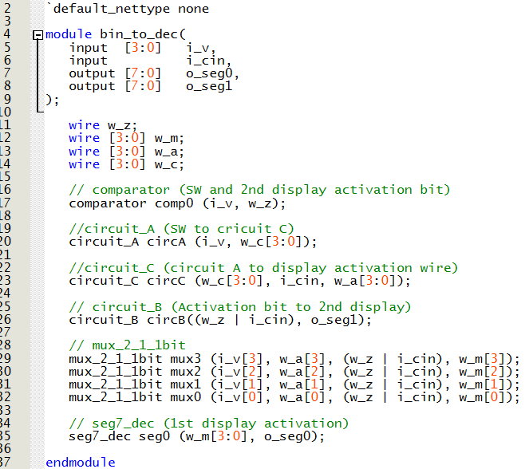

*Figure 4.6 — Main module Implementation*

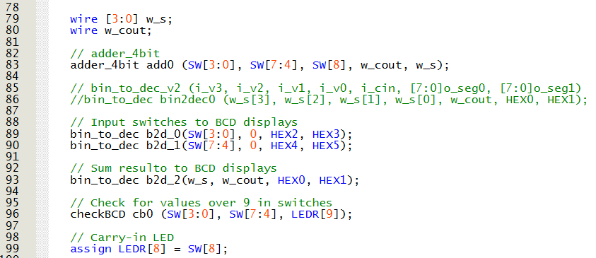

### Demonstration

*Figure 4.7 — 8-bit adder (ripple-carry) Demonstration*

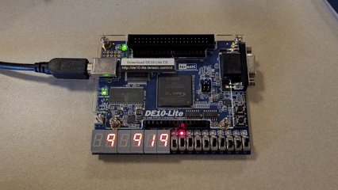
