# Lab 3 — Latches, Flip-flops, and Registers (FPGA DE10-Lite)

This repository documents the second FPGA lab using the DE10-Lite (MAX 10 10M50DAF484C7G).  
The purpose of this exercise is to investigate latches, flip-flops, and registers.

<!-- Table of content -->
<nav>
  <h1>Table of Contents</h2>
  <ul>
    <li><a href="#Part I">Part I</a></li>
    <li><a href="#Part II">Part II</a></li>
    <li><a href="#Part III">Part III</a></li>
    <li><a href="#Part IV">Part IV</a></li>
    <li><a href="#Part V">Part V</a></li>
  </ul>
</nav>

<!-- Sections -->
<h2 id="Part I">Part I — Gated RS Latch</h2>  

### Objective
Create a gated SR Latch as an storage element. It will update the output state only when the enable signal is active.

### Logic / Design
A module is created as a Gated SR Latch. With S (Set), R (Reset) and clk (clock) as inputs it will desplay the value storaged. If S signal is active and the clk signal too, the active value will remain in the output. Until the R signal and the clk signal are active at the same time, reseting the output.

Figure 1.1 — Gated SR Latch Design

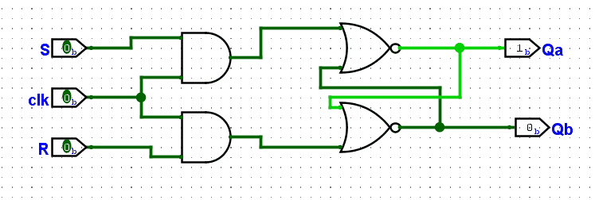

With the RTL Viewer, it can be stablished that the logic from this part matches the Verilog code, consecuently the functionality will remain the same.

Figure 1.2 — Gated SR Latch RTL Viewer

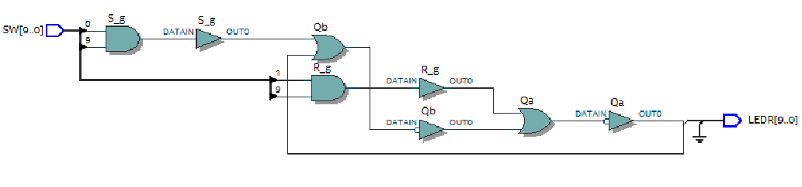

To be able to observe the internal signals when compiled, it is necesary to include the compiler directive ("/* synthesis keep /*").

### Implementation

*Figure 1.3 — SR Latch Implementation*

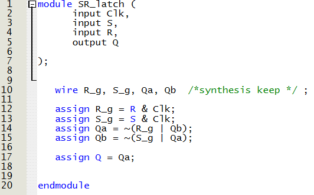

*Figure 1.4 — Main block Implementation*

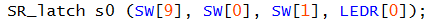

### Demonstration

*Figure 1.5 — SR Latch Demonstration*

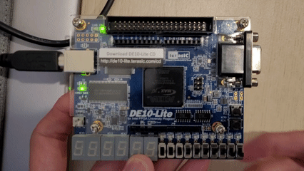

<h2 id="Part II">Part II — Gated D Latch</h2>  

### Objective
Create a gated D Latch as an storage element. It will update the output state when the enable signal is active.

### Logic / Design
A module is created as a Gated D Latch. With D (Set) and clk (clock) as inputs it will desplay the value storaged. If D signal is active and the clk signal too, the active value will remain in the output. And only when the clk signal is active and D signal 0, the output will reset.

Figure 2.1 — Gated D Latch Design

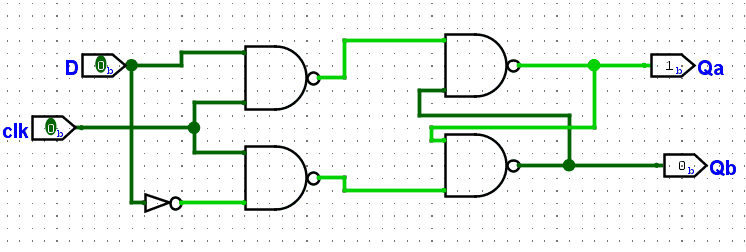

With the RTL Viewer, it can be stablished that the logic from this part matches the Verilog code, consecuently the functionality will remain the same.

Figure 2.2 — Gated D Latch RTL Viewer

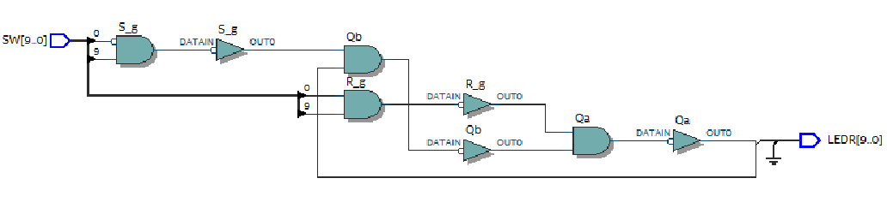

### Implementation

*Figure 2.3 — D Latch Implementation*

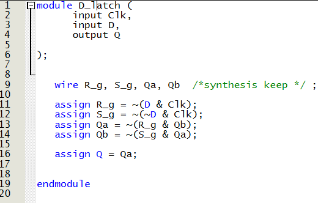

*Figure 2.4 — Main block Implementation*

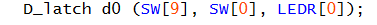

### Demonstration

*Figure 2.5 — D Latch Demonstration*

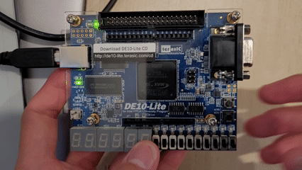

<h2 id="Part III">Part III — Master-slave D Flip-flop</h2>  

### Objective
Create a gated D Flip-flop as an storage element. It will store the output state when the enable signal is active.

### Logic / Design
A module is created as a D Flip-flop using two D latch modules. With D (Set) and clk (clock) as inputs it will desplay the value storaged. If D signal is active and the clk signal too, the active value will be stored in the output.

Figure 3.1 — D Flip-flop Design

With the RTL Viewer, it can be stablished that the logic from this part matches the Verilog code, consecuently the functionality will remain the same.

Figure 3.2 — D Flip-flop RTL Viewer

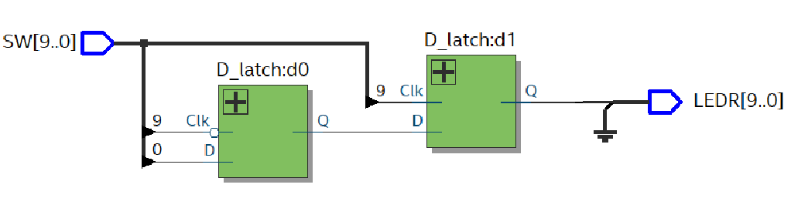

### Implementation

*Figure 3.3 — Main module Implementation*

### Demonstration

*Figure 3.4 — D Flip-flop Demonstration*

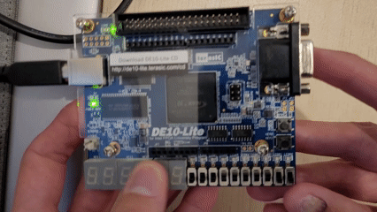

<h2 id="Part IV">Part IV — D Latch, Positive-edge triggered D Flip-flop and Negative-edge triggered D Flip-flop</h2>  

### Objective
Instantiate the three storage elements: D Latch, Positive-edge triggered D Flip-flop and Negative-edge triggered D Flip-flop.

### Logic / Design
Using the modules from previous parts, the behavioral style Verilog code is implemented.

With the RTL Viewer, it can be stablished that the logic from this part matches the Verilog code, consecuently the functionality will remain the same.

Figure 4.1 — Storage elements RTL Viewer

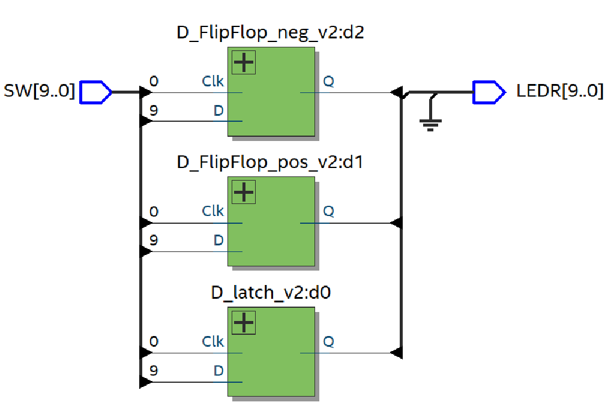

### Implementation

*Figure 4.2 — D Latch module Implementation*

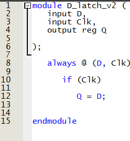

*Figure 4.3 — Positive-edge D Flip-flop module Implementation*

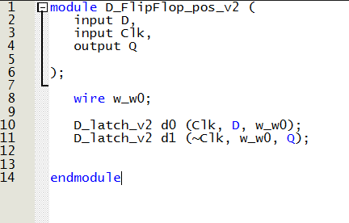

*Figure 4.4 — Negative-edge D Flip-flop module Implementation*

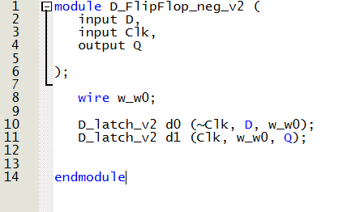

*Figure 4.5 — Main module Implementation*

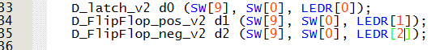

### Demonstration

*Figure 4.6 — Storage elements Demonstration*

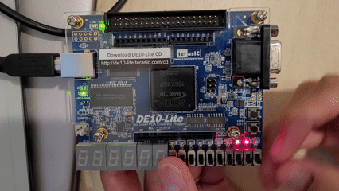

<h2 id="Part V">Part V — Store and display two 8-bit BCD numbers in 7-segment display</h2>  

### Objective
Store and display the values of two 8-bit BDC numbers using the same input switches.

### Logic / Design
A first 8-bit input 'A' will be set in the switches. Once the input Set signal is active, the value will be stored and displayed in three 7-segments displays. Then a second 8-bit input 'B' can be set using the same switches and with the Set signal active, the value will be stored and displayed in three 7-segments displays. Only when setting the signal Reset to active, the values will be errased.

With the RTL Viewer, it can be seen the functionality using Flip Flops.

Figure 5.1 — Storage elements and logic RTL Viewer

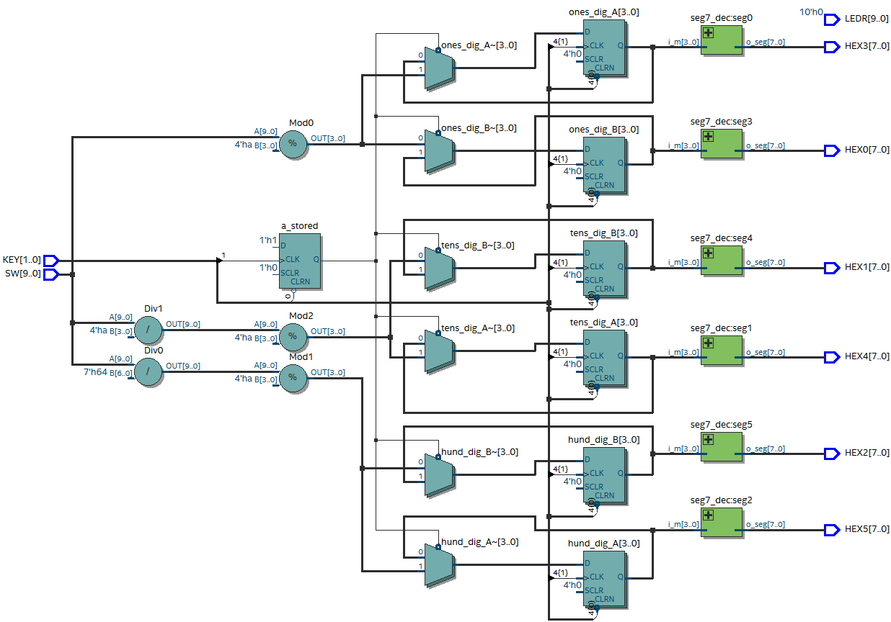

### Implementation

*Figure 5.2 — Main module Implementation*

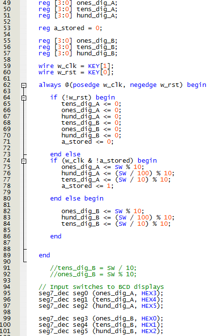

### Demonstration

*Figure 5.3 — Two 8-bit BCD numbers stored Demonstration*

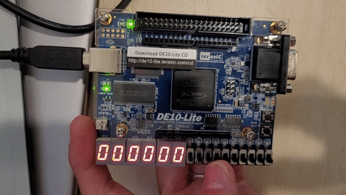

