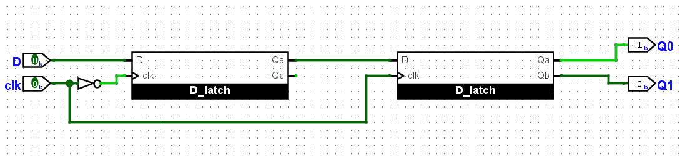
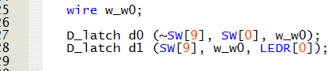

# Lab 3 — Latches, Flip-flops, and Registers (FPGA DE10-Lite)

This repository documents the second FPGA lab using the DE10-Lite (MAX 10 10M50DAF484C7G).  
The purpose of this exercise is to investigate latches, flip-flops, and registers.

<!-- Table of content -->
<nav>
  <h1>Table of Contents</h2>
  <ul>
    <li><a href="#Part I">Part I</a></li>
    <li><a href="#Part II">Part II</a></li>
    <li><a href="#Part III">Part III</a></li>
    <li><a href="#Part IV">Part IV</a></li>
    <li><a href="#Part V">Part V</a></li>
  </ul>
</nav>

<!-- Sections -->
<h2 id="Part I">Part I — Gated RS Latch</h2>  

### Objective
Create a gated SR latch as a storage element. It updates the output state only when the enable signal is active.

### Logic / Design
A module is created as a gated SR latch. With S (Set), R (Reset), and clk (clock) as inputs, it will display the stored value.
- If both S and clk are active, the output is set to 1 and remains stored.
- If both R and clk are active, the output is reset to 0

Figure 1.1 — Gated SR Latch Design

The RTL Viewer confirms that the logic matches the Verilog code; consequently, the functionality is preserved.

Figure 1.2 — Gated SR Latch RTL Viewer

To be able to observe the internal signals when compiled, it is necesary to include the compiler directive ("/* synthesis keep /*").

### Implementation

*Figure 1.3 — SR Latch Implementation*

*Figure 1.4 — Main block Implementation*

### Demonstration

*Figure 1.5 — SR Latch Demonstration*

<h2 id="Part II">Part II — Gated D Latch</h2>  

### Objective
Create a gated D Latch as a storage element. It updates the output state when the enable signal is active.

### Logic / Design
A module is created as a gated D latch. With D (data) and clk (clock) as inputs, it will display the stored value.
- When clk is active and D = 1, the output is set to 1.
- When clk is active and D = 0, the output resets to 0.

Figure 2.1 — Gated D Latch Design

The RTL Viewer confirms that the logic matches the Verilog code; consequently, the functionality is preserved.

Figure 2.2 — Gated D Latch RTL Viewer

### Implementation

*Figure 2.3 — D Latch Implementation*

*Figure 2.4 — Main block Implementation*

### Demonstration

*Figure 2.5 — D Latch Demonstration*

<h2 id="Part III">Part III — Master-slave D Flip-flop</h2>  

### Objective
Create a D flip-flop using two D latch modules. It stores the output state on the clock edge.

### Logic / Design
A module is created as a master-slave D flip-flop using two gated D latches. With D (data) and clk (clock) as inputs, it will display the stored value.
- On the clock transition, the master latch captures the input, and the slave latch updates the output accordingly.

Figure 3.1 — D Flip-flop Design

The RTL Viewer confirms that the logic matches the Verilog code; consequently, the functionality is preserved.

Figure 3.2 — D Flip-flop RTL Viewer

### Implementation

*Figure 3.3 — Main module Implementation*

### Demonstration

*Figure 3.4 — D Flip-flop Demonstration*

<h2 id="Part IV">Part IV — D Latch, Positive-edge triggered D Flip-flop and Negative-edge triggered D Flip-flop</h2>  

### Objective
Instantiate the three storage elements: D Latch, Positive-edge triggered D Flip-flop and Negative-edge triggered D Flip-flop.

### Logic / Design
Using the modules from previous parts, a behavioral-style Verilog implementation is created.

The RTL Viewer confirms that the logic matches the Verilog code; consequently, the functionality is preserved.

Figure 4.1 — Storage elements RTL Viewer

### Implementation

*Figure 4.2 — D Latch module Implementation*

*Figure 4.3 — Positive-edge D Flip-flop module Implementation*

*Figure 4.4 — Negative-edge D Flip-flop module Implementation*

*Figure 4.5 — Main module Implementation*

### Demonstration

*Figure 4.6 — Storage elements Demonstration*

<h2 id="Part V">Part V — Store and display two 8-bit BCD numbers in 7-segment display</h2>  

### Objective
Store and display the values of two 8-bit BCD numbers using the same input switches.

### Logic / Design
- The first 8-bit input A is set using the switches. When the Set input is activated, the value is stored and displayed on three 7-segment displays.
- The second 8-bit input B is then set using the same switches. When the Set input is activated again, the value is stored and displayed on three 7-segment displays.
- When the Reset input is activated, both stored values are erased.

The RTL Viewer confirms the functionality using flip-flops.

Figure 5.1 — Storage elements and logic RTL Viewer

### Implementation

*Figure 5.2 — Main module Implementation*

### Demonstration

*Figure 5.3 — Two 8-bit BCD numbers stored Demonstration*

