# Lab 4 — Counters (FPGA DE10-Lite)

This repository documents the fourth FPGA lab using the DE10-Lite (MAX 10 10M50DAF484C7G).  
The purpose of this exercise is to build and use counters.

<!-- Table of content -->
<nav>
  <h1>Table of Contents</h1>
  <ul>
    <li><a href="#Part I">Part I</a></li>
    <li><a href="#Part II">Part II</a></li>
    <li><a href="#Part III">Part III</a></li>
    <li><a href="#Part IV">Part IV</a></li>
    <li><a href="#Part V">Part V</a></li>
  </ul>
</nav>

<!-- Sections -->
<h2 id="Part I">Part I — T Flip-Flop counter</h2>  

### Objective
Create a 4-bit synchronous counter using four T-type flip-flops.

### Logic / Design
A module is created for a T flip-flop, with T (set) and clk (clock) as inputs, based on a D flip-flop with two AND gates and one OR gate. It toggles the output value:
- If both T and clk are active, the output toggles from 0 to 1 or from 1 to 0.
With a 1-bit T flip-flop, a counter can be created by instantiating multiple modules. In this case, an 8-bit counter is implemented, but for functionality verification purposes using Logisim, a 4-bit counter has been designed.

*Figure 1.1 — T-Flip-flop 1-bit Design*

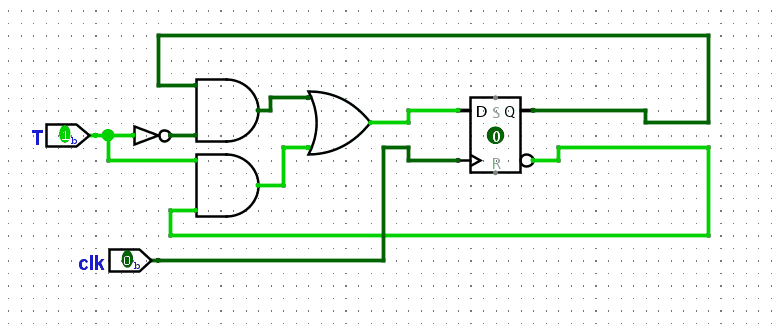

*Figure 1.2 — T-Flip-flop 4-bit Counter Design*

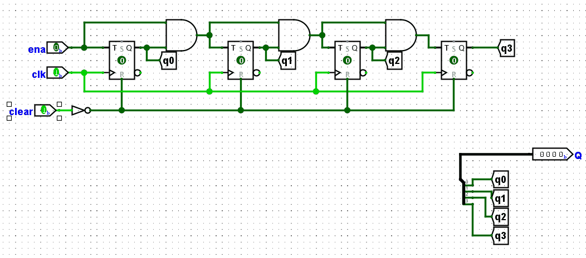

The RTL Viewer confirms that the logic matches the Verilog code; consequently, the functionality is preserved.

*Figure 1.3 — T-Flip-flop 1-bit RTL Viewer*

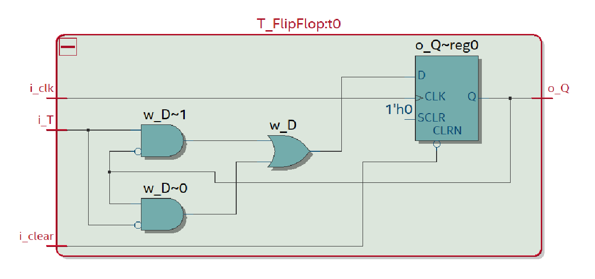

*Figure 1.4 — T-Flip-flop 8-bit RTL Viewer*

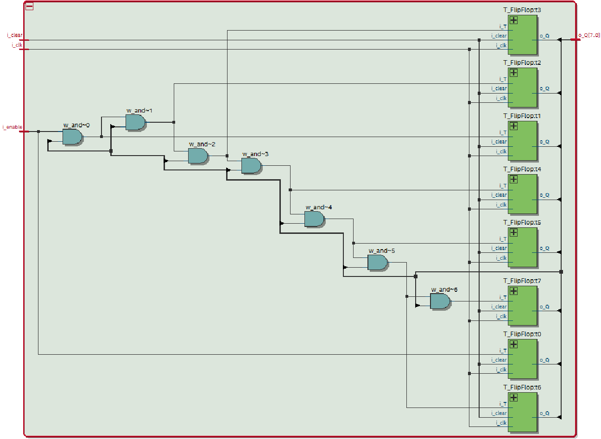

From this exercise onward, to avoid switch and button bouncing (a hardware issue), a 1-second counter from previous labs has been used to act as a clock (clk) signal.

### Implementation

*Figure 1.5 — T-Flip-flop 1-bit Implementation*

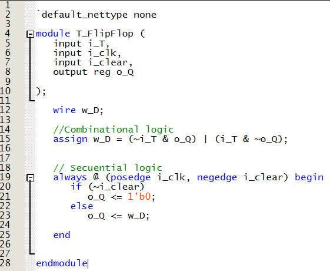

*Figure 1.6 — T-Flip-flop 1-bit Main module Implementation*

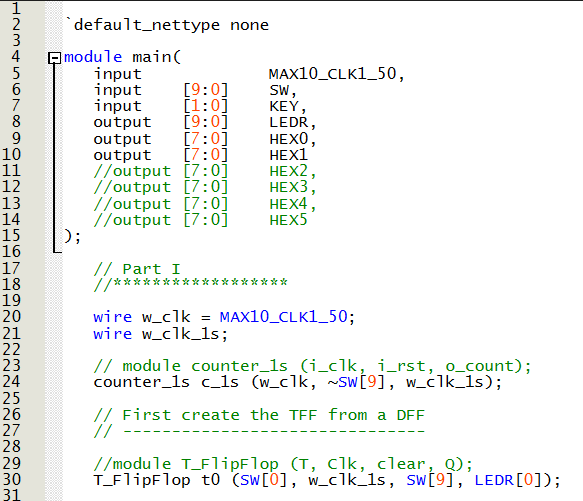

*Figure 1.7 — T-Flip-flop 8-bit Implementation*

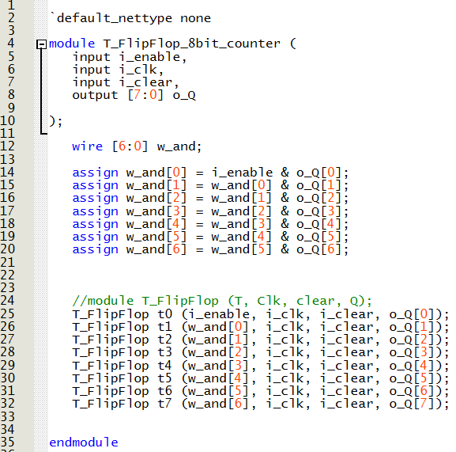

*Figure 1.8 — T-Flip-flop 8-bit Main module Implementation*

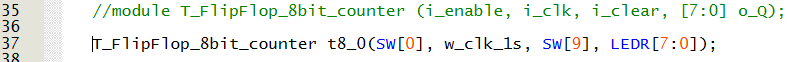

*Figure 1.9 — T-Flip-flop 8-bit to 7-segment display Main module Implementation*

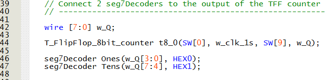

### Demonstration

*Figure 1.10 — T-Flip-flop 1-bit Demonstration*

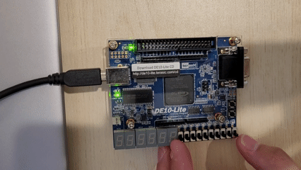

*Figure 1.11 — T-Flip-flop 8-bit Counter Demonstration*

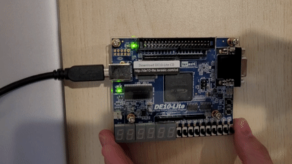

*Figure 1.12 — T-Flip-flop 8-bit Counter to 7-segment display Demonstration*

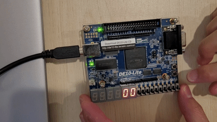

<h2 id="Part II">Part II — 16-bit Counter</h2>  

### Objective
Create a 16-bit synchronous counter using a register that adds 1 to its value.

### Logic / Design
A module is created as an adder using sequential logic with the expression:
Q <= Q + 1

The RTL Viewer shows a D flip-flop implemented with the output carried into the D input through an adder block.

*Figure 2.1 — 16-bit Counter RTL Viewer*

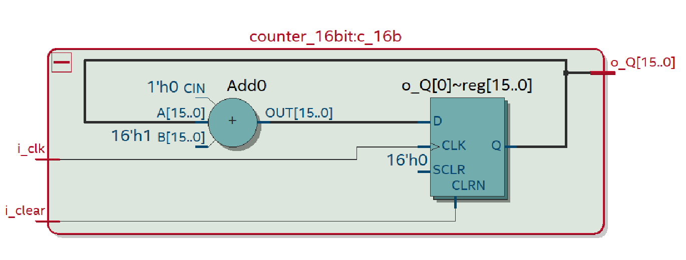

### Implementation

*Figure 2.2 — 16-bit Counter Implementation*

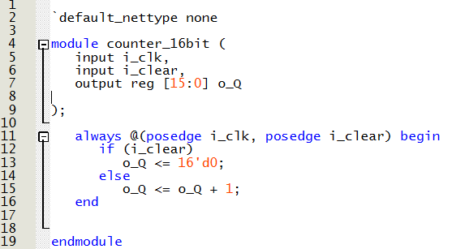

*Figure 2.3 — Main Module Implementation*

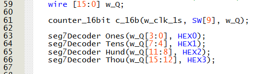

### Demonstration

*Figure 2.4 — 16-bit Counter Demonstration*

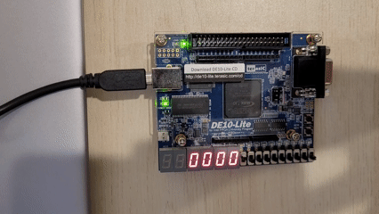

<h2 id="Part III">Part III — 16-bit Counter with an LPM </h2>  

### Objective
Create a 16-bit synchronous counter using an LPM (Library of Parameterized Modules) component.

### Logic / Design
An LPM counter module is generated with an enable and synchronous clear to match the previous designs.

*Figure 3.1 — LPM Counter Configuration*

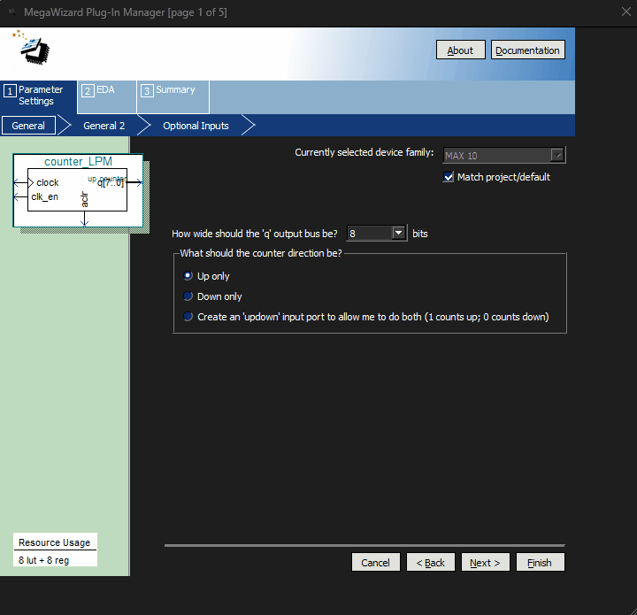

### Implementation

*Figure 3.2 — Main module Implementation*

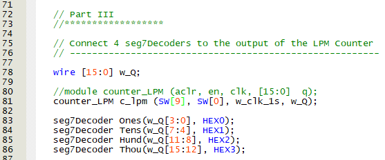

### Demonstration

*Figure 3.3 — 16-bit LPM Counter Demonstration*

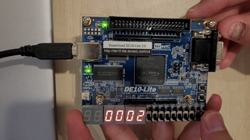

<h2 id="Part IV">Part IV — BCD Counter</h2>  

### Objective
Create a BCD counter operating at one-second intervals.

### Logic / Design
A 1-second counter module is created using previous components. Instead of generating a fixed 1-second model, a generic clock divider module is implemented. This allows frequency adjustment by simply modifying a local parameter in the main module.

A BCD counter module increments the value each second and counts tens, hundreds, and thousands when the previous digit reaches 9.
Each digit is then displayed on the 7-segment displays using a BCD decoder module.

### Implementation

*Figure 4.1 — Clock reduction module Implementation*

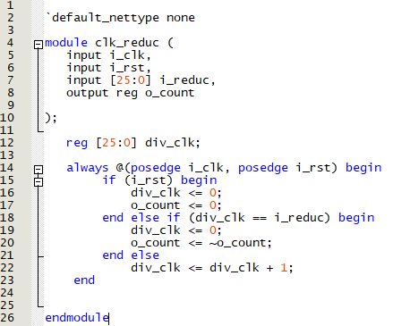

*Figure 4.2 — BCD Counter module Implementation*

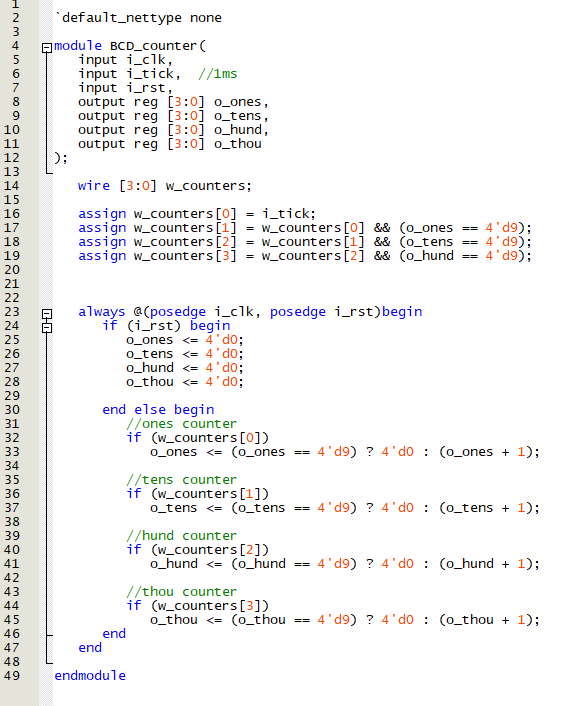

*Figure 4.3 — BCD Decoder module Implementation*

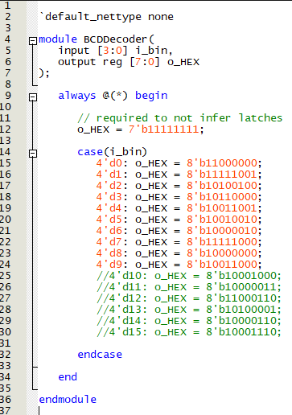

*Figure 4.4 — Main module Implementation*

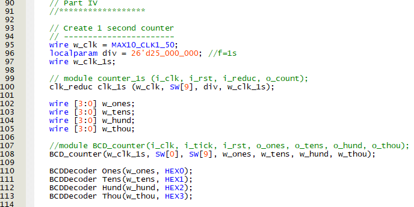

### Demonstration

*Figure 4.5 — BCD Counter Demonstration*

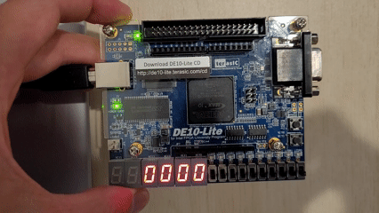

<h2 id="Part V">Part V — Display HELLO in ticker-tape fashion</h2>  

### Objective
Display the word HELLO in ticker-tape fashion on the 7-segment displays, moving the letters from right to left every second.

### Logic / Design
The same clock reduction module from the previous part is used to obtain a 1-second signal. Additionally, a generic counter module determines the state of each display.
Using the resulting count, a HELLO Decoder module determines which letter to display on each 7-segment display. A second decoder module then activates the appropriate segments to form the corresponding letter.

### Implementation

*Figure 5.1 — Counter up module Implementation*

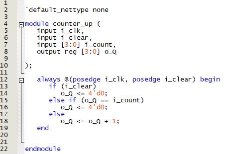

*Figure 5.2 — HELLO Decoder module Implementation*

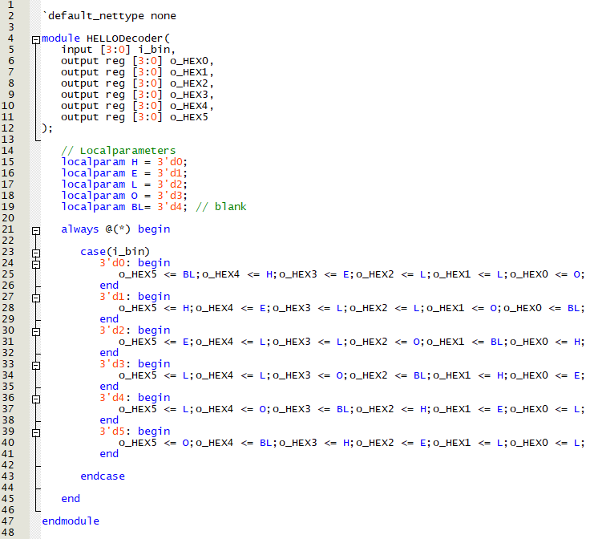

*Figure 5.3 — 7-segment display decoder module Implementation*

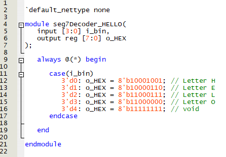

*Figure 5.4 — Main module Implementation*

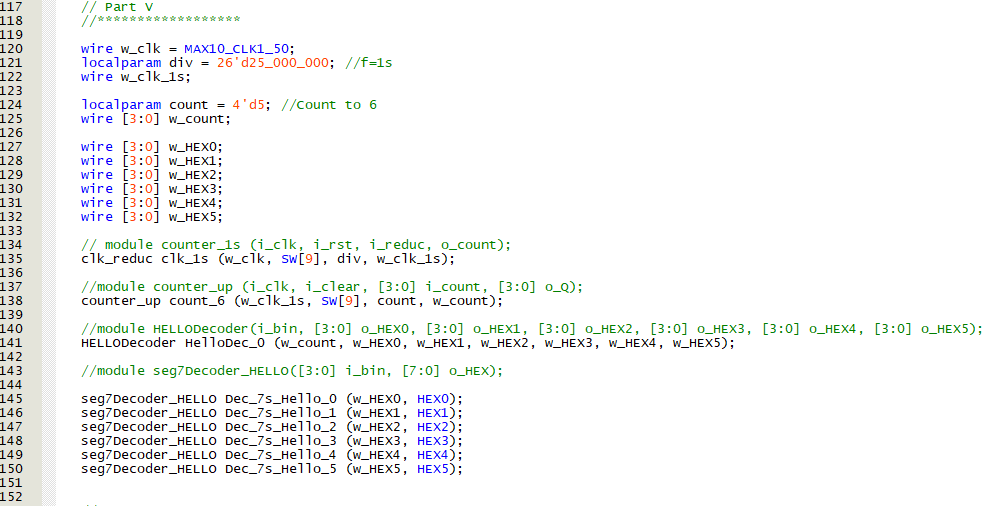

### Demonstration

*Figure 5.5 — HELLO movement Demonstration*

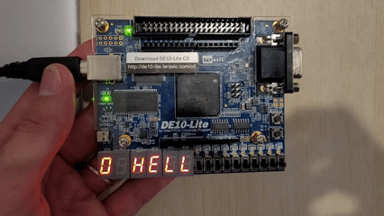
