# Lab 5 — Adders, Subtractors, and Multipliers (FPGA DE10-Lite)

This repository documents the 5th FPGA lab using the DE10-Lite (MAX 10 10M50DAF484C7G).  
The purpose of this exercise is to examine arithmetic circuits that add, subtract, and multiply numbers.

<!-- Table of content -->
<nav>
  <h1>Table of Contents</h1>
  <ul>
    <li><a href="#Part I">Part I</a></li>
    <li><a href="#Part II">Part II</a></li>
    <li><a href="#Part III">Part III</a></li>
    <li><a href="#Part IV">Part IV</a></li>
    <li><a href="#Part V">Part V</a></li>
  </ul>
</nav>

<!-- Sections -->
<h2 id="Part I">Part I — 8-bit Accumulator adder</h2>  

### Objective
Create an 8-bit Accumulator circuit with an adder.

### Logic / Design
An 8.bit accumulator adder is made o two 8-bit registers to store the input value and the output result to beeing abla to opearate with them. A 1-bit register for the overflow and the Adder Logic Unit (ALU) to process the operation. The design represented on the Figure 1.1 shows the label wires to clarify the conection between the Registers and the ALU. The register module and adder module are universal modules to adapt to the number of bits needed. 
And to avoid bouncing with the buttons, a debounce module is provided to eliminate that mechanical error.
The modules used to Decode the number in binary to BCD and desiplayed in the 7-segment displayed are taken form previous labs.

*Figure 1.1 — 8-bit Accumulator Design*

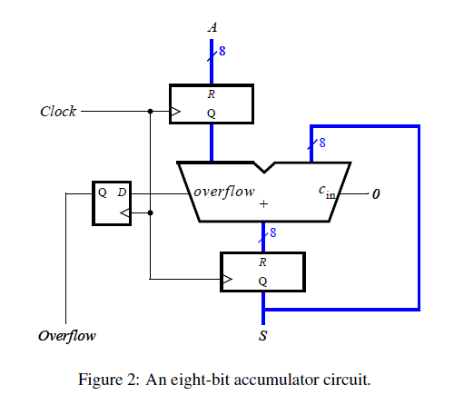

### Implementation

*Figure 1.2 — Dbounce module Implementation*

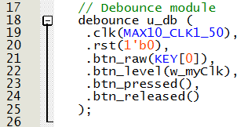

*Figure 1.3 — Register n-bit module Implementation*

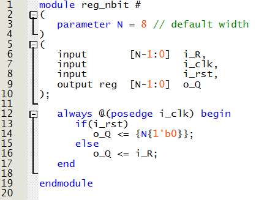

*Figure 1.4 — Adder n-bit module Implementation*

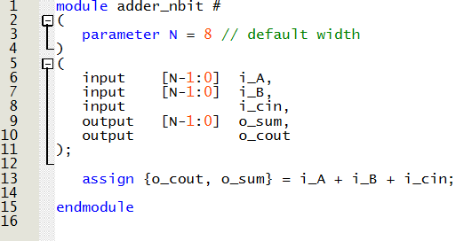

*Figure 1.5 — 8-bit Accumulator module Implementation*

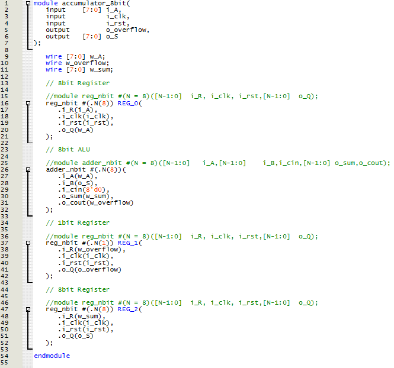

*Figure 1.6 — Main module Implementation*

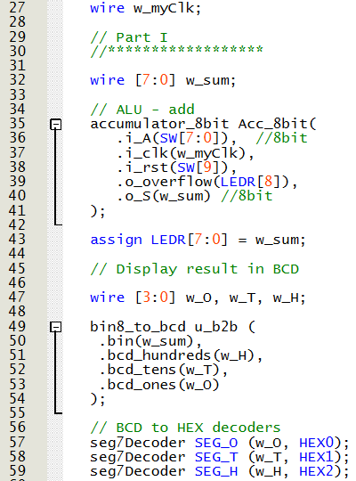

### Demonstration

*Figure 1.7 — 8-bit Accumulator adder Demonstration*

<h2 id="Part II">Part II — 16-bit Counter</h2>  

### Objective
Create a 16-bit synchronous counter using a register that adds 1 to its value.

### Logic / Design
A module is created as an adder using sequential logic with the expression:
Q <= Q + 1

The RTL Viewer shows a D flip-flop implemented with the output carried into the D input through an adder block.

*Figure 2.1 — 16-bit Counter RTL Viewer*

### Implementation

*Figure 2.2 — 16-bit Counter Implementation*

*Figure 2.3 — Main Module Implementation*

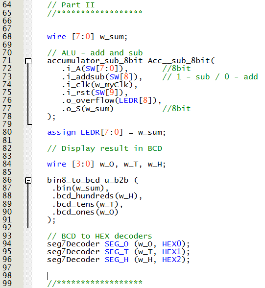

### Demonstration

*Figure 2.4 — 16-bit Counter Demonstration*

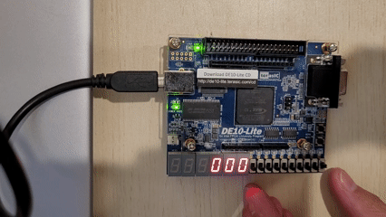

<h2 id="Part III">Part III — 16-bit Counter with an LPM </h2>  

### Objective
Create a 16-bit synchronous counter using an LPM (Library of Parameterized Modules) component.

### Logic / Design
An LPM counter module is generated with an enable and synchronous clear to match the previous designs.

*Figure 3.1 — LPM Counter Configuration*

### Implementation

*Figure 3.2 — Main module Implementation*

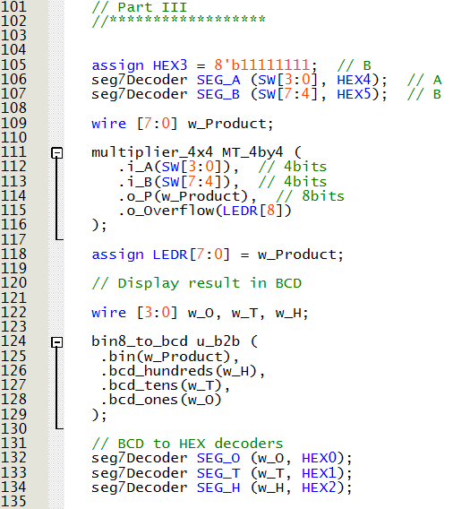

### Demonstration

*Figure 3.3 — 16-bit LPM Counter Demonstration*

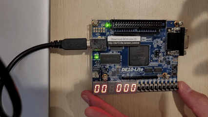

<h2 id="Part IV">Part IV — BCD Counter</h2>  

### Objective
Create a BCD counter operating at one-second intervals.

### Logic / Design
A 1-second counter module is created using previous components. Instead of generating a fixed 1-second model, a generic clock divider module is implemented. This allows frequency adjustment by simply modifying a local parameter in the main module.

A BCD counter module increments the value each second and counts tens, hundreds, and thousands when the previous digit reaches 9.
Each digit is then displayed on the 7-segment displays using a BCD decoder module.

### Implementation

*Figure 4.1 — Clock reduction module Implementation*

*Figure 4.2 — BCD Counter module Implementation*

*Figure 4.3 — BCD Decoder module Implementation*

*Figure 4.4 — Main module Implementation*

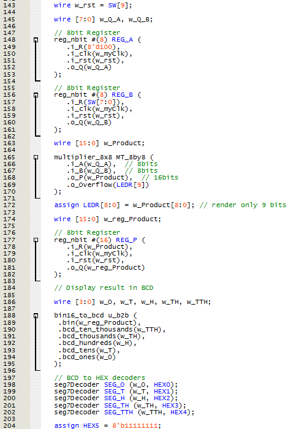

### Demonstration

*Figure 4.5 — BCD Counter Demonstration*

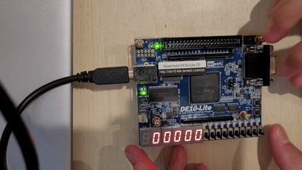

<h2 id="Part V">Part V — Display HELLO in ticker-tape fashion</h2>  

### Objective
Display the word HELLO in ticker-tape fashion on the 7-segment displays, moving the letters from right to left every second.

### Logic / Design
The same clock reduction module from the previous part is used to obtain a 1-second signal. Additionally, a generic counter module determines the state of each display.
Using the resulting count, a HELLO Decoder module determines which letter to display on each 7-segment display. A second decoder module then activates the appropriate segments to form the corresponding letter.

### Implementation

*Figure 5.1 — Counter up module Implementation*

*Figure 5.2 — HELLO Decoder module Implementation*

*Figure 5.3 — 7-segment display decoder module Implementation*

*Figure 5.4 — Main module Implementation*

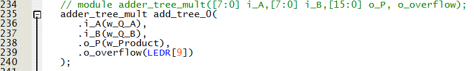

### Demonstration

*Figure 5.5 — HELLO movement Demonstration*

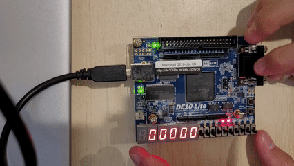
