# Lab 5 — Adders, Subtractors, and Multipliers (FPGA DE10-Lite)

This repository documents the 5th FPGA lab using the DE10-Lite (MAX 10 10M50DAF484C7G).  
The purpose of this exercise is to examine arithmetic circuits that add, subtract, and multiply numbers.

<!-- Table of content -->
<nav>
  <h1>Table of Contents</h1>
  <ul>
    <li><a href="#Part I">Part I</a></li>
    <li><a href="#Part II">Part II</a></li>
    <li><a href="#Part III">Part III</a></li>
    <li><a href="#Part IV">Part IV</a></li>
    <li><a href="#Part V">Part V</a></li>
  </ul>
</nav>

<!-- Sections -->
<h2 id="Part I">Part I — 8-bit Accumulator adder</h2>  

### Objective
Design and implement an 8-bit accumulator adder circuit using Verilog, capable of storing and adding input values through clock cycles.

### Logic / Design
The design consists of:
- Two 8-bit registers: one to store the input value and another to hold the accumulated result. 
- A 1-bit register for the overflow flag.
- An Adder Logic Unit (ALU) to perform the arithmetic operation.
- A debounce module to eliminate mechanical bouncing from button inputs.
- Binary-to-BCD conversion and 7-segment display modules (reused from previous labs).
The circuit connects switches SW7–0 as inputs, with results shown on the 7-segment displays. The carry-out (overflow) is displayed on LEDR8.

*Figure 1.1 — 8-bit Accumulator Design*

### Implementation

*Figure 1.2 — Dbounce module Implementation*

*Figure 1.3 — n-bit Register module Implementation*

*Figure 1.4 — n-bit Adder module Implementation*

*Figure 1.5 — 8-bit Accumulator module Implementation*

*Figure 1.6 — Main module Implementation*

### Demonstration

*Figure 1.7 — 8-bit Accumulator adder Demonstration*

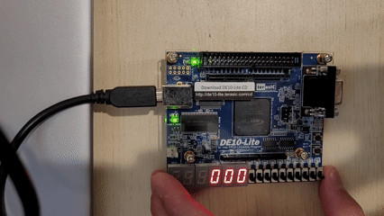

<h2 id="Part II">Part II — 8-bit Accumulator Adder/Subtractor</h2>  

### Objective
Extend the accumulator circuit to perform both addition and subtraction operations.

### Logic / Design
Building on Part I, a control signal add_sub is introduced:
- i_addsub = 0 → Perform addition
- i_addsub = 1 → Perform subtraction
This control signal is used in a conditional assignment within the ALU logic and switch SW8 is assigned as the operation selector.

### Implementation

*Figure 2.1 — Adder/Subtractor module Implementation*

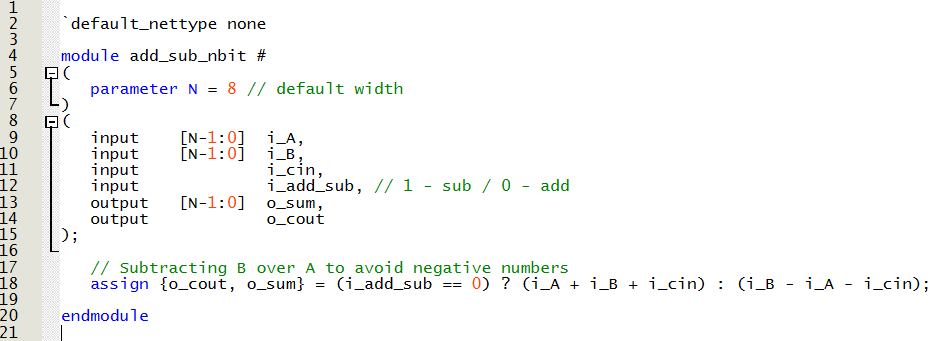

*Figure 2.2 — 8-bit Accumulator module Implementation*

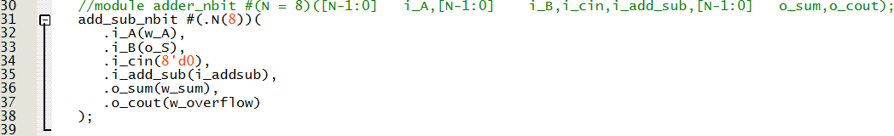

*Figure 2.3 — Main module Implementation*

### Demonstration

*Figure 2.4 — 8-bit Accumulator adder/sub Demonstration*

<h2 id="Part III">Part III — 4-bit Multiplication with Full Adders</h2>  

### Objective
Design a 4-bit multiplier using full adders and logic gates.

### Logic / Design
The circuit multiplies two 4-bit binary numbers A and B to produce an 8-bit product P. Each partial product is formed using AND gates and added using full adders arranged in three summation stages, as illustrated below.

*Figure 3.1 — Multiplication Theory*

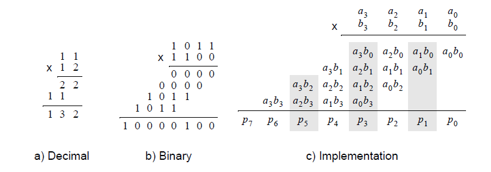

*Figure 3.2 — Multiplication circuit design*

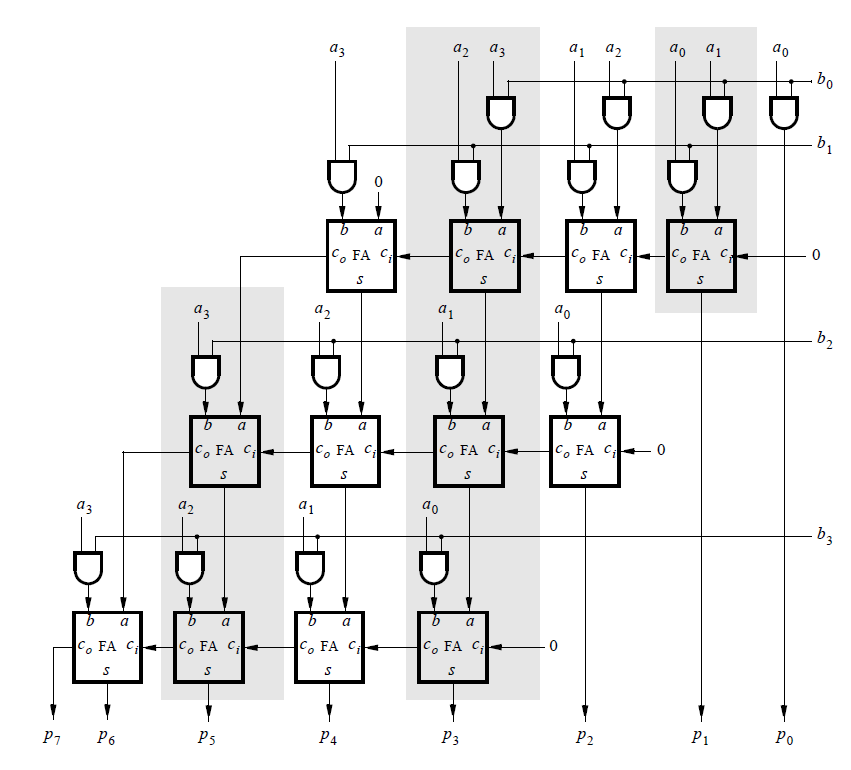

### Implementation

*Figure 3.3 — 1st Stage Multiplier Implementation*

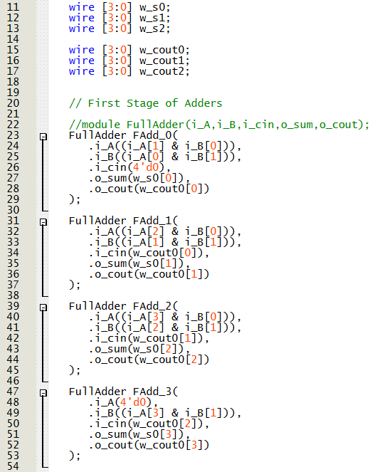

*Figure 3.4 — 2nd Stage Multiplier Implementation*

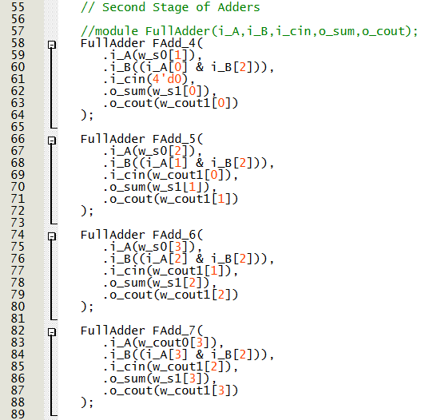

*Figure 3.5 — 3rd Stage Multiplier Implementation*

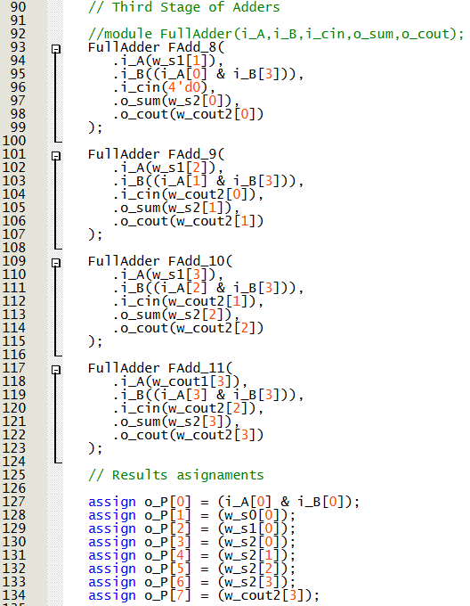

*Figure 3.6 — Main module Implementation*

### Demonstration

*Figure 3.7 — 4-bit multiplier Demonstration*

<h2 id="Part IV">Part IV — 8-bit Multiplication with n-bit Adders</h2>  

### Objective
Implement an 8×8 multiplier using multiple n-bit adders to sum the partial products.

### Logic / Design
The design extends the array multiplier concept to 8 bits, using seven n-bit adders to combine shifted partial products generated by AND gates. The structure is modular and reuses the previously verified adder modules.

*Figure 4.1 — Multiplication circuit design*

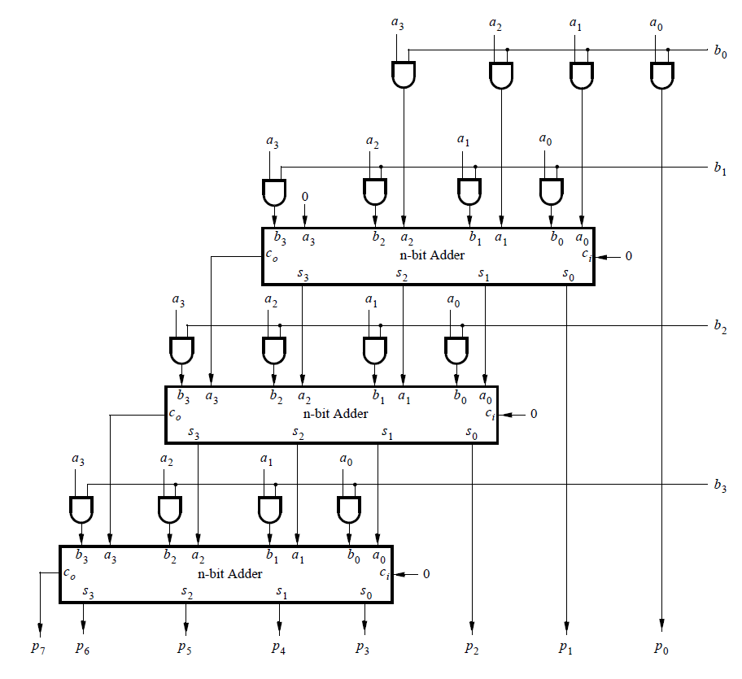

### Implementation

*Figure 4.2 — Partial products Implementation*

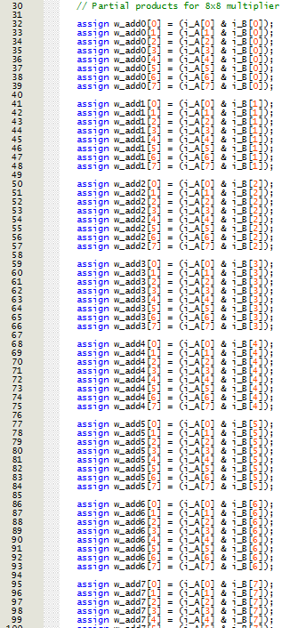

*Figure 4.3 — 1st to 3rd Stage Multiplier Implementation*

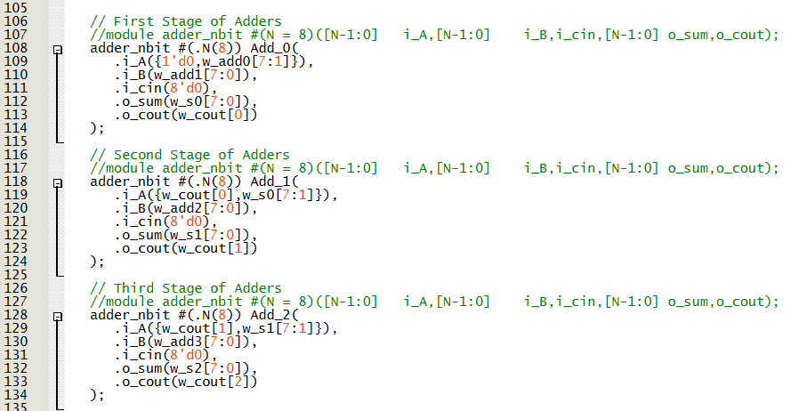

*Figure 4.4 — 4th to 6th Stage Multiplier Implementation*

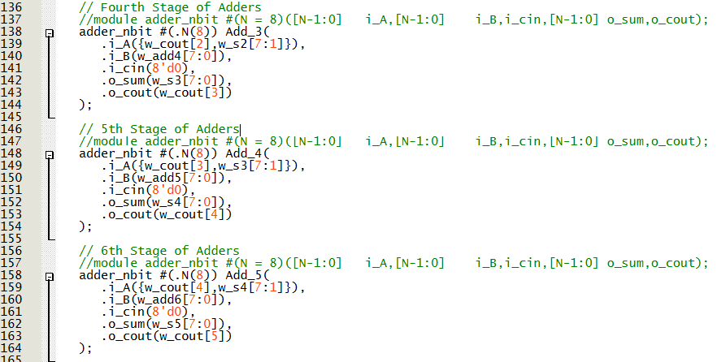

*Figure 4.5 — 7th Stage Multiplier Implementation*

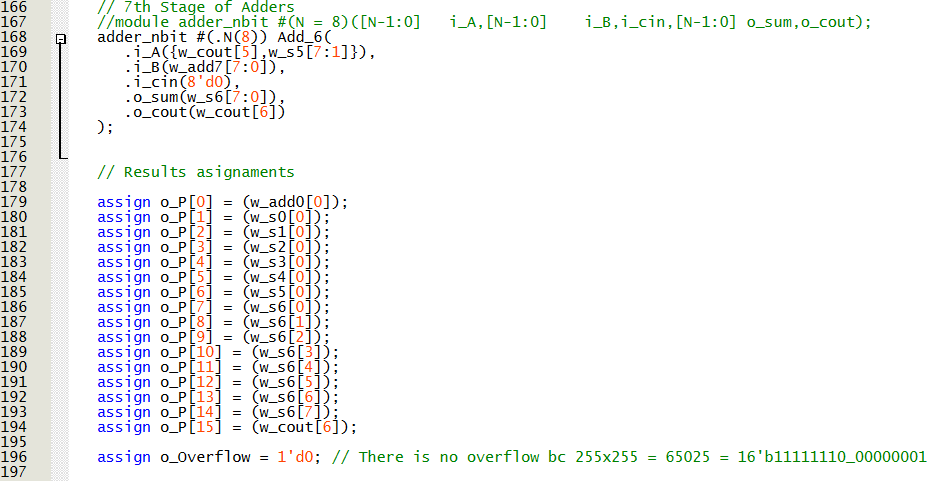

*Figure 4.6 — Main module Implementation*

### Demonstration

*Figure 4.7 — 8-bit multiplier Demonstration*

<h2 id="Part V">Part V — 8-bit Multiplication with Adder Tree</h2>  

### Objective
Design an optimized 8×8 multiplier using an adder tree structure, improving performance through parallel summation.

### Logic / Design
Instead of adding partial products sequentially, the adder tree performs additions in parallel reduction structure.
For-loop constructs are used to automatically generate partial products and connect them through the adder tree hierarchy.

*Figure 5.1 — Multiplication circuit concept*

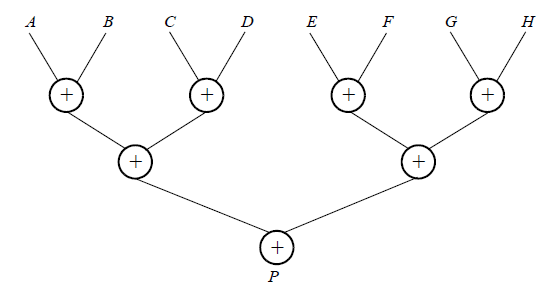

### Implementation

*Figure 5.2 — Adder tree module Implementation*

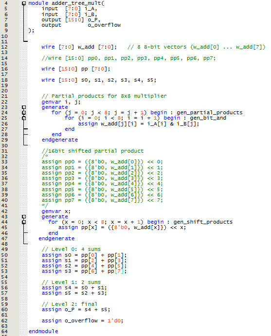

*Figure 5.3 — Main module Implementation*

### Demonstration

*Figure 5.4 — 8-bit multiplier Demonstration*

