# Lab 6 — Chess Clock (FPGA DE10-Lite)

This repository documents the 6th FPGA lab using the DE10-Lite (MAX 10 10M50DAF484C7G).  
The purpose of this exercise is to implement a Chess Clock using FSM logic.

<!-- Table of content -->
<nav>
  <h1>Table of Contents</h1>
  <ul>
    <li><a href="#Objective">Objective</a></li>
    <li><a href="#Design">Design and Logic</a></li>
    <li><a href="#Implementation">Implementation</a></li>
    <li><a href="#Demonstration">Demonstration</a></li>
    <li><a href="#Future">Future Improvements</a></li>
  </ul>
</nav>

<h2 id="Objective">Objective</h2>
Design and implement a chess clock using an FSM. The system allows the configuration of initial player times, and decrement each player's timer when their opponent presses their button. When a timer reaches zero the match ends and the 7-segments displays indicates the winner.

<h2 id="Design">Design and Logic</h2>
The system is built using five main states, implemented as a Moore FSM with one-hot encoding for easy debugging via LEDR outputs.

The design consists of five states:
- S1: Config -- Where the user can adjust the play time of each player individually. Using the buttons to add or subtract 30s to the timer.
- S2: Idle -- This state is a waiting state, where the times of each player have already been selected and is whaiting to one of the players press their respective button to start the game.
- S3: Counter 1 -- With Button 1 pressed, the timer starts decreasing until it reaches zero or the other button is pressed.
- S4: Counter 2 -- With Button 2 pressed, the timer starts decreasing until it reaches zero or the other button is pressed.
- S5: End game -- When one of the counters turns zero, the game ends and the opponent player wins.
The FSM returns to Idle after reset.

State      | Input condition            | Next state    | Actions / outputs
-----------|--------------------------- |---------------|--------------------------------
S_CONFIG   | set_done                   | S_IDLE        | load time1/time2
S_IDLE     | p1_button (press)          | S_Counter1    | start P1 countdown
S_IDLE     | p2_button (press)          | S_Counter2    | start P2 countdown
S_Counter1 | p1_button (press)          | S_Counter2    | stop P1, start P2
S_Counter1 | timeout_p1 (t1 == 0)       | S_END         | set winner = P2
S_Counter2 | p2_button (press)          | S_Counter1    | stop P2, start P1
S_Counter2 | timeout_p2 (t2 == 0)       | S_END         | set winner = P1
S_END      | reset                      | S_IDLE        | reload initial times

Modules:
- FSM_ChessTimer -- Controls the system states using Moore FSM. One-hot encoded for easy visualization with the LEDR.
- Time_selector -- Configures the starting time for each player, adding 30 seconds to the timer with the Button[0] and subtracting 30s with the Button[1]. The SW[1] is used to select wich player is the time being modified.
- Display_controller -- This module allows to control the sequence displayed on the 7-segments displays on each state. When State is Config, Counter1 or Counter2, the displays will show the time. When Idle state, the word "Go" will be displayed. And when finished the game, "done" + "winner player" will be seen. This module also includes a decoder to convert the total seconds remaining into M.SS format.

And other modules as the debounce, counter_1s and the counter_nbits ae used from previous class excercices or labs.

*Figure 1.1 — State diagram Design*

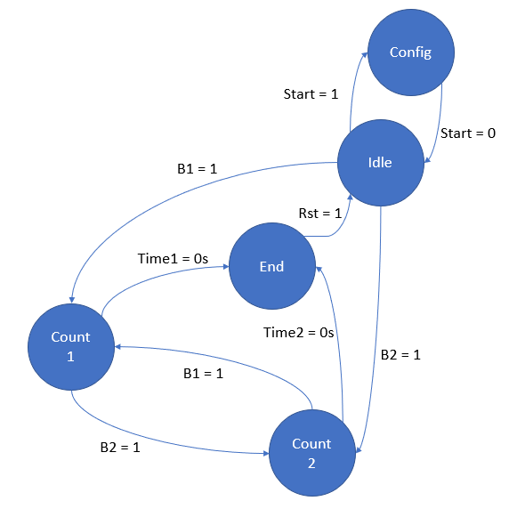

*Figure 1.2 — Block diagram abstraction Design*

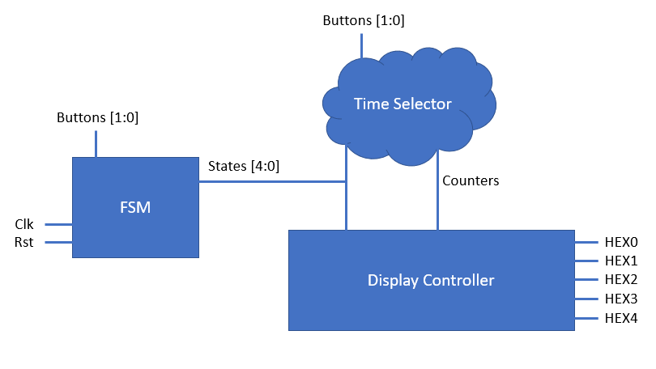

<h2 id="Implementation">Implementation</h2>

*Figure 1.3 — FSM module states Implementation*

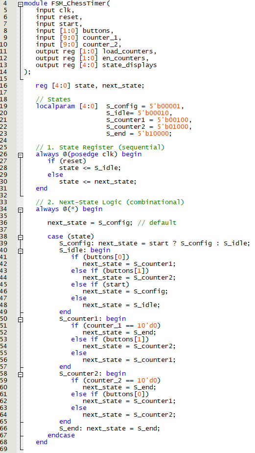

*Figure 1.4 — FSM module output Implementation*

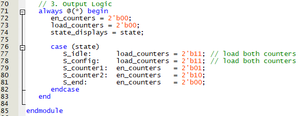

*Figure 1.5 — Display controller module Implementation*

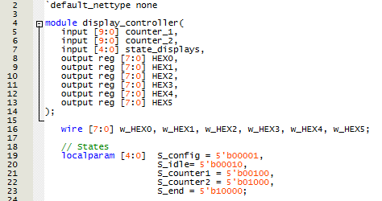

*Figure 1.6 — Display controller states module Implementation*

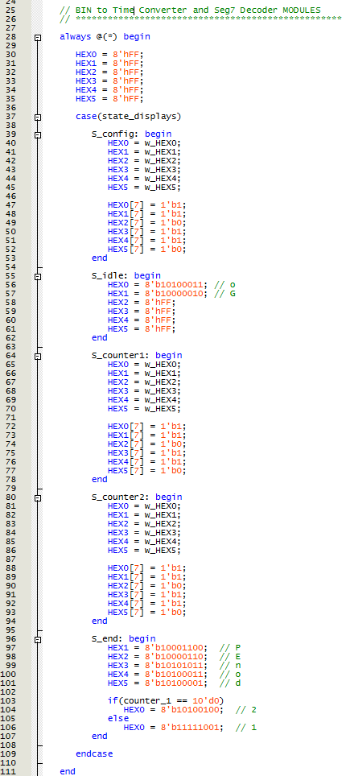

*Figure 1.7 — Display controller decoder module Implementation*

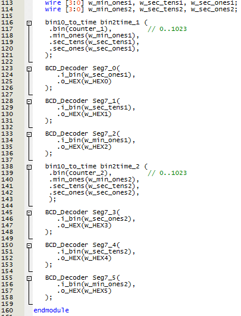

*Figure 1.8 — Time selection module Implementation*

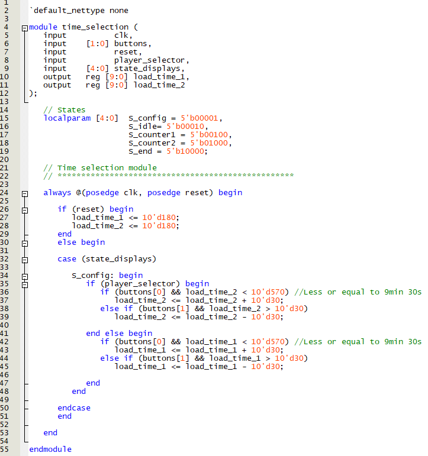

*Figure 1.9 — BIN to time module Implementation*

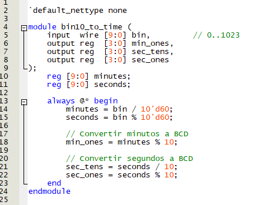

*Figure 1.10 — Debounce in Main module Implementation*

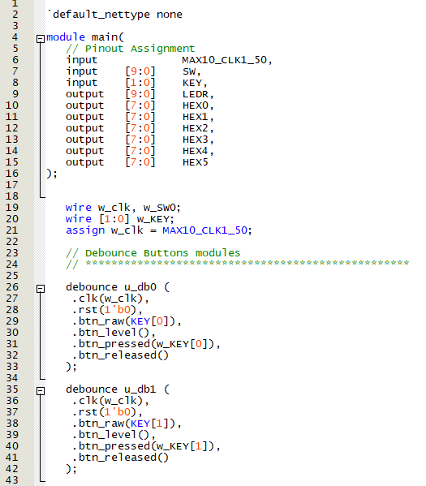

*Figure 1.11 — FSM in Main module Implementation*

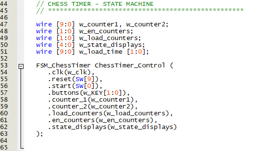

*Figure 1.12 — Time selection in Main module Implementation*

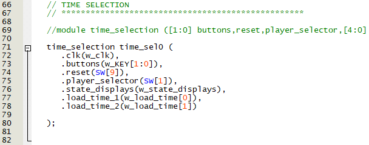

*Figure 1.13 — Counters and display in Main module Implementation*

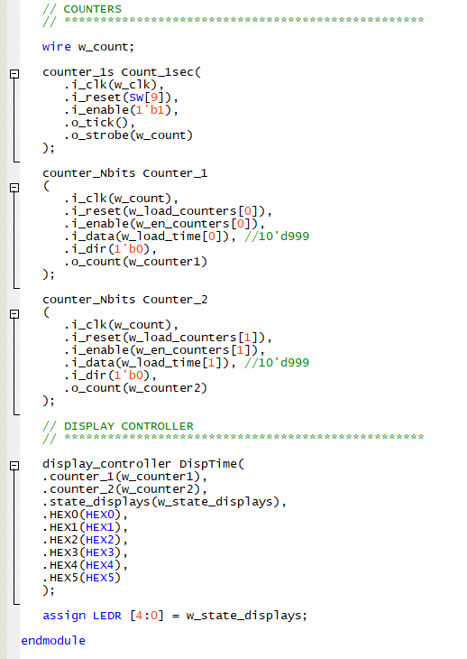

<h2 id="Demonstration">Demonstration</h2>

*Figure 1.14 — FSM Chess Clock Demonstration*

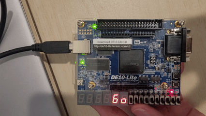

<h2 id="Future">Future Improvements</h2>

- Add increment mode (Fischer delay) to simulate tournament conditions.

- Include pause/resume functionality using an extra button.

