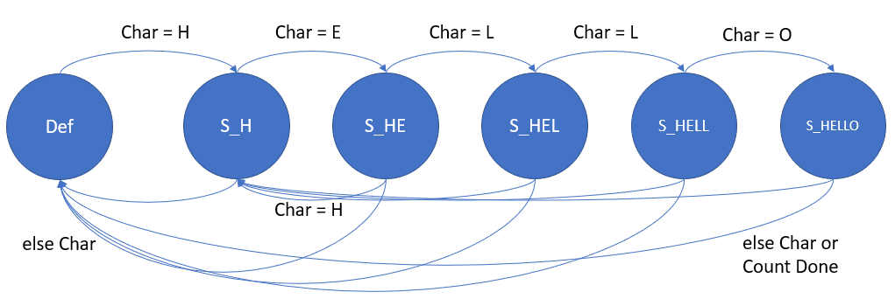
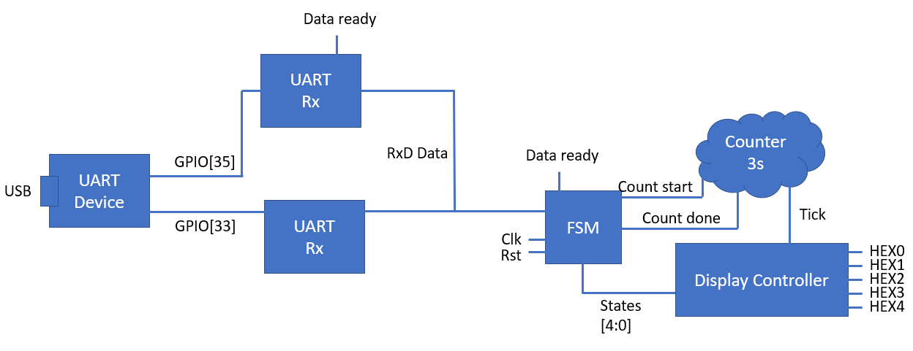
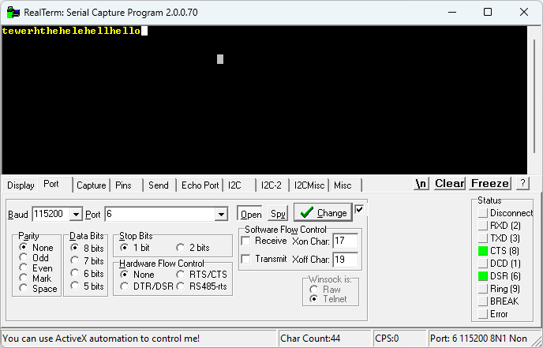
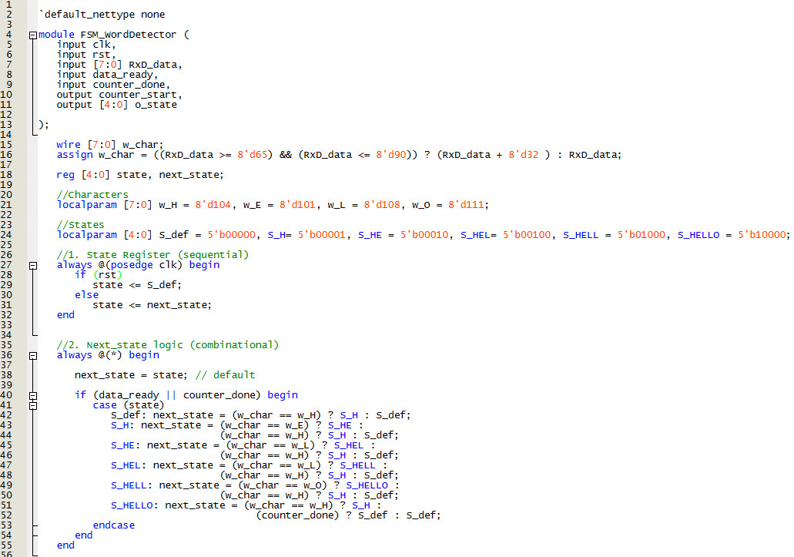
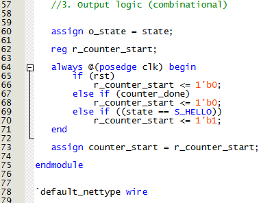
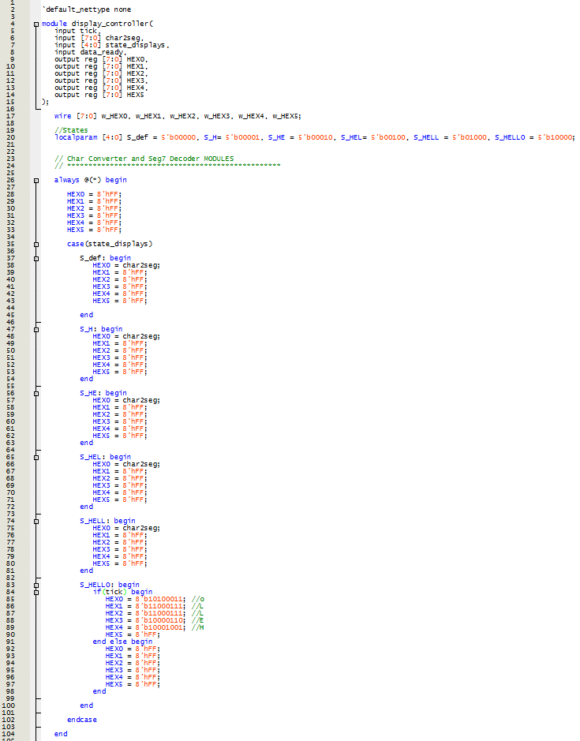
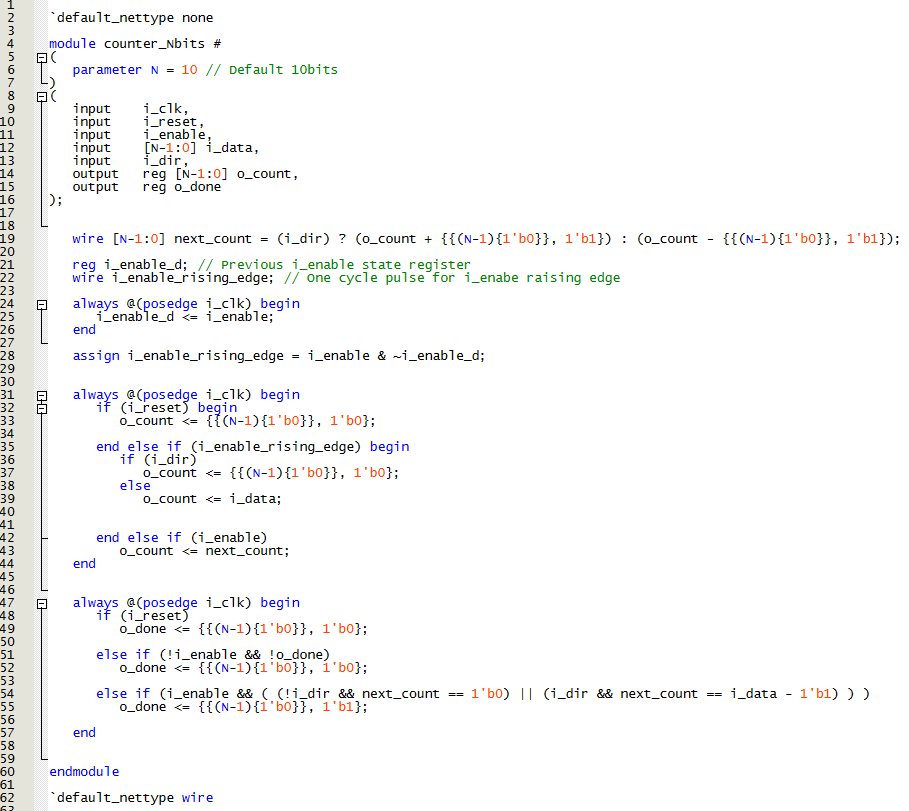
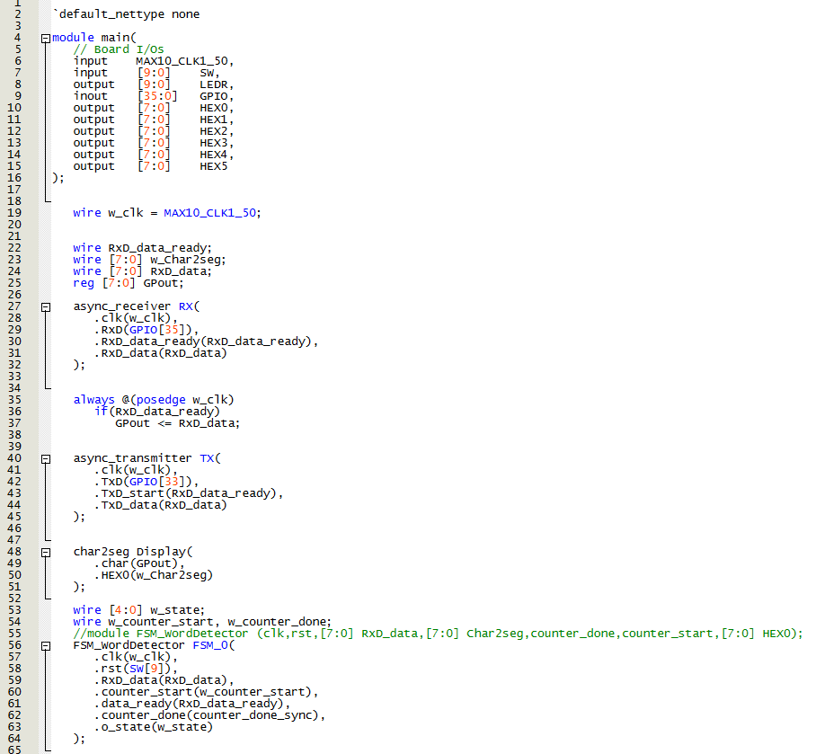
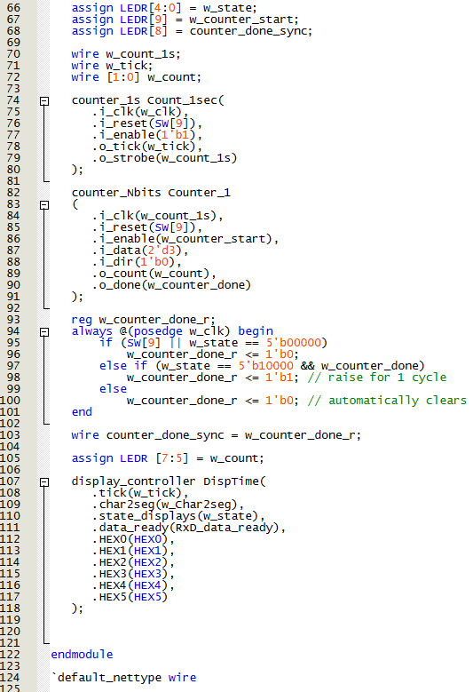
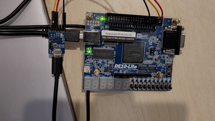

# Lab 7 — UART Communication (FPGA DE10-Lite)

This repository documents the 7th FPGA lab using the DE10-Lite (MAX 10 10M50DAF484C7G).  
The purpose of this exercise is to establish communication between the FPGA and a UART interface.

<!-- Table of content -->
<nav>
  <h1>Table of Contents</h1>
  <ul>
    <li><a href="#Objective">Objective</a></li>
    <li><a href="#Design">Design and Logic</a></li>
    <li><a href="#Implementation">Implementation</a></li>
    <li><a href="#Demonstration">Demonstration</a></li>
  </ul>
</nav>

<h2 id="Objective">Objective</h2>
Design and implement a communication system between the FPGA and a UART.
The system should be able to receive characters from a serial terminal (RealTerm), interpret them as ASCII codes, and display them on the FPGA’s 7-segment displays.
When the received sequence of characters matches the word “hello”, the system should trigger a timed blinking display of that word, after which the FSM returns to its default waiting state.

<h2 id="Design">Design and Logic</h2>
The system is built using five main states, implemented as a Moore FSM with one-hot encoding for easy debugging via LEDR outputs.

UART (Universal Asynchronous Receiver/Transmitter) is a serial communication protocol that transmits data bit by bit using two lines:
- Tx (Transmit) → sends data from the FPGA to the PC terminal.
- Rx (Receive) → receives data from the PC terminal to the FPGA.

Each character typed in the terminal is transmitted as an ASCII code, which the FPGA receives, decodes, and then displays.
For this lab, both async_receiver and async_transmitter modules were provided by the instructor to handle serial communication timing, start/stop bits, and data-ready flags automatically.

An overview of how this modules work:
- async_recieve module: The async_receiver handles UART reception, taking the serial input (rx) and converting it into an 8-bit parallel value that the FPGA can use. It works asynchronously and uses oversampling to decode the UART frame: start bit, 8 data bits, and stop bit. The module keeps monitoring rx for a falling edge, which marks the start bit. Once detected, an internal counter samples the line in the middle of each bit period to reduce noise. Each of the next eight bits is shifted into a register, building the received byte. After the stop bit, a data_ready flag is asserted for one clock cycle, signaling that the byte is valid. The data is then sent to the FSM and char2seg module to display it on the HEX output. Noise between transmissions is ignored, and the receiver automatically goes back to idle after each stop bit, making communication reliable even at 9600 bps.
- async_transmitter module: The async_transmitter sends data from the FPGA to the PC via UART (tx). It takes 8-bit parallel data and serializes it according to the UART protocol. When txD_start is high, the transmitter loads the data into a shift register and starts sending: first a start bit (0), then the 8 data bits (LSB first), and finally a stop bit (1). While sending, txD_busy stays high to prevent new data from being loaded until the frame is done. A clock divider makes sure each bit lasts the right amount of time. Once done, txD_busy goes low and tx returns to idle (1).

The design consists of five states corresponding to the progressive detection of the word “HELLO”:

State      | Input condition            | Next state    | Actions / outputs
-----------|--------------------------- |---------------|--------------------------------
S_Def      | Char = H                   | S_H           | Display character
S_H        | Char = E                   | S_HE          | Display character
S_H        | Char != E                  | S_Def         | 
S_HE       | Char = L                   | S_HEL         | Display character
S_HE       | Char = H                   | S_H           | 
S_HE       | Else Char                  | S_Def         | 
S_HEL      | Char = L                   | S_HELL        | Display character
S_HEL      | Char = H                   | S_H           | 
S_HEL      | Else Char                  | S_Def         | 
S_HELL     | Char = O                   | S_HELLO       | Display character
S_HELL     | Char = H                   | S_H           | 
S_HELL     | Else Char                  | S_Def         | 
S_HELLO    | Count Done                 | S_Def         | Show Blinking "HELLO"
S_HELLO    | Char = H                   | S_H           | 
S_HELLO    | Else Char                  | S_Def         | 

Modules:

- UART receiver/transmitter -- These two modules handle the serial communication between the FPGA and the computer terminal (RealTerm). Every key press in the terminal are sent as an ASCII code through the UART line. The FPGA receives, decodes, and displays this value. All numbers and letters compatible with 7-segment display format are shown.
- Char2seg -- char2seg converts ASCII characters into 7-segment codes, so the FPGA can display letters or numbers received via UART. It first converts uppercase letters to lowercase (adding 32 to the ASCII code) because the segment table uses lowercase. Then, a combinational case statement maps each supported character to an 8-bit pattern. For example, 'A' (65) becomes 'a' (97) and maps to 8'b10001000, lighting up the segments for “a.” Numbers '0'–'9' are mapped similarly. Unsupported characters default to 8'hFF, turning all segments off.
- FSM_Word_detector -- It converts uppercase ASCII characters to lowercase, checks the received sequence, and changes states accordingly. The FSM transitions only when a new character is received or when the 3-second counter finishes, forcing a reset to the default state.
- Counter 3s -- counter_3s creates a ~3-second delay by counting FPGA clock cycles. The FSM uses it to automatically reset or trigger state changes after a certain time (like returning to the default state after a message). It uses an N-bit register that decrements every clock cycle when enable is high. When it reaches the terminal count, counter_done is asserted for one clock cycle and the counter resets. The FSM uses counter_done to switch from S_HELLO back to the default state. The counter can be restarted in any timed state by asserting counter_start.
- Display_controller -- Manages the visual output on the 7-segment displays. In all intermediate states, the display shows the character received via UART. When the FSM reaches S_HELLO, the word “HELLO” is displayed across the five displays and blinks once per second, synchronized with the 1-second tick from counter_1s.
- Debug Signals -- For debugging, internal control signals such as counter_start, counter_done, and the 3-second timer value are mapped to the LEDs (LEDR) for real-time observation of system behavior.

Additional utility modules, like debounce and counter_1s, were reused from previous labs.

Development Challenges: 

One of the main challenges was ensuring the synchronization between the FSM and the 3-second counter.
Initially, the FSM remained stuck in the S_HELLO state because the counter’s done signal either never cleared or was detected for more than one clock cycle, preventing the FSM from cycling back to its default state.
This issue was resolved by edge-detecting the counter_done signal and synchronizing it with the main FSM clock.
Additionally, the FSM logic was modified to differentiate between data_ready and counter_done events, giving reset priority to the timer pulse without interfering with new UART inputs.
This ensured that once the timer completed and the word finished blinking, the FSM correctly reset to S_Def, ready to detect the word HELLO again.

*Figure 1.1 — State diagram Design*

*Figure 1.2 — Block diagram abstraction Design*

*Figure 1.3 — RealTerm Command Window*

<h2 id="Implementation">Implementation</h2>

*Figure 1.4 — FSM module states Implementation*

*Figure 1.5 — FSM module output Implementation*

*Figure 1.6 — Display controller module Implementation*

*Figure 1.7 — Counter N-bits module Implementation*

*Figure 1.8 — UART and FSM in Main module Implementation*

*Figure 1.9 — Counter and Display in Main module Implementation*

<h2 id="Demonstration">Demonstration</h2>

*Figure 1.10 — FSM Chess Clock Demonstration*

