# Lab 8 — Very Simple Microprocessor (VSM) (FPGA DE10-Lite)

This repository documents the 8th FPGA lab using the DE10-Lite development board (MAX 10 10M50DAF484C7G).
The goal of this exercise is to design a very simple microprocessor (VSM) and enable UART communication between the FPGA and a PC terminal.
 
<!-- Table of content -->
<nav>
  <h1>Table of Contents</h1>
  <ul>
    <li><a href="#Objective">Objective</a></li>
    <li><a href="#Design">Design and Logic</a></li>
    <li><a href="#Implementation">Implementation</a></li>
    <li><a href="#Demonstration1">Demonstration Part 1</a></li>
    <li><a href="#UART">UART communication</a></li>
    <li><a href="#Demonstration2">Demonstration Part 2</a></li>
    <li><a href="#Future">Future Improvements</a></li>
  </ul>
</nav>

<h2 id="Objective">Objective</h2>
Starting from a Logisim schematic provided by the instructor, the objective is to design a simple Von-Neumann microprocessor that implements the following assembly instructions:

Instructions      | OpCode       
------------------|-------------
NOP               | 00                  
ADD <- Data       | 1[Data]  
SUB <- Data       | 2[Data]  
Out               | 30  
In                | 40  
LOAD <- Data      | 5[Data]  

*Figure 1.1 — VSM Architecture*

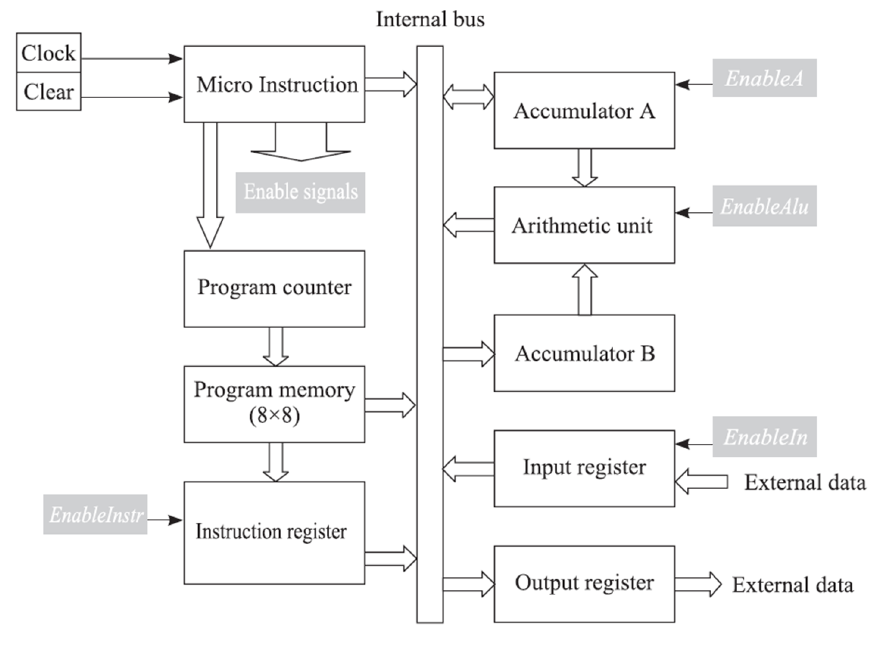

<h2 id="Design">Design and Logic</h2>
The FSM instructions are executed as a sequence of a four internal micro-operations, also called microinstructionns. The period of execution of each instruction can be devided into four time phases:
- Fetch -- Get instruction from memory
- Decode -- Run instruction
- Execute 1 -- Get data
- Execute 2 -- Run data

The architecture is Von-Neumann style: a single internal bus interconnects all modules and carries both data and instructions.

- Program memory (16x8) -- The program memory stores the program. Each program line has an 8-bit format. The four most significant bits represents the instruction itself, and the four least significant bits represent the data attached to the instruction, if necessary. The order of instructions done in this lab are the following:
55 --> Accumulator A = 5
12 --> Accumulator A = 5 + 2 = 7
30 --> Output = 7
28 --> Accumulator A = 8 + 7 = 1
30 --> Output = 1
40 --> Accumulator A = #Switches
13 --> Accumulator A = #Switches + 3  
30 --> Output = A
- Program Counter -- The program counter counts from 0000 to 1111. It monitors the address of the active instruction. Initially, the program counter is set to 0000, so the microprocessor starts with the instruction at the first memory location.
- Accumulator A -- The accumulator A is a 4-bit register. It is used to store one of the operands for the arithmetic operation. It also stores the intermediate results computed by the microporcessor. When requested, the accumulator result is placed on the internal bus.
- Accumulator B -- The accumulator B is also a 4-bit register. It is used to store the second operand for an aithmetic operation. For addition, this operand is added to accumulator A and for substraction, accumulator A is substracted form operand.
- Arithmetic Unit (ALU) -- The arithemtic logic unit performs the operations of Addition (S = A + B) or Subtraction (S = B + ~A + 1).
- Input register -- The input register gives the ability to transfer data form the outside world to the micropocessor.
- Output register -- The output register transfer the content of the internal bus to the outside world.
- FSM -- Sequences the four phases for each instruction and asserts the control signals (LatchA, EnableA, LatchB, EnableALU, EnableIN, EnableOut, LoadInstr, EnableInstr, etc.).

Additional utility modules, like debounce and 7-segment decoder, was reused from previous labs.

*Figure 1.2 — Signal sequence for each phase*

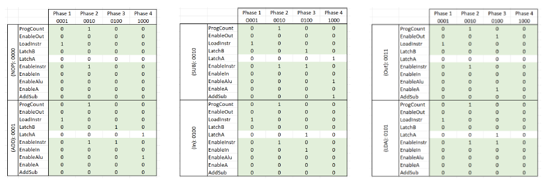

*Figure 1.3 — VSM circuit*

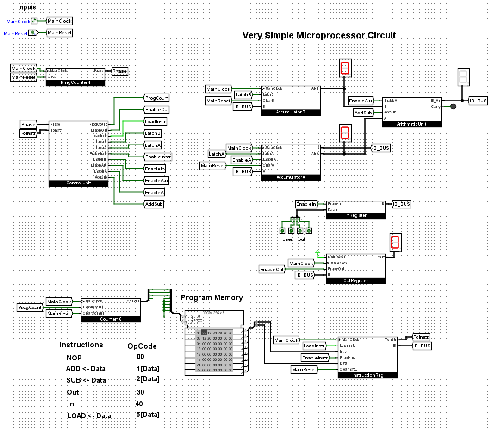

<h2 id="Implementation">Implementation</h2>

*Figure 1.4 — Memory module Implementation*

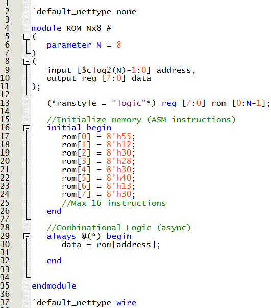

*Figure 1.5 — Memory module RTL Viewer*

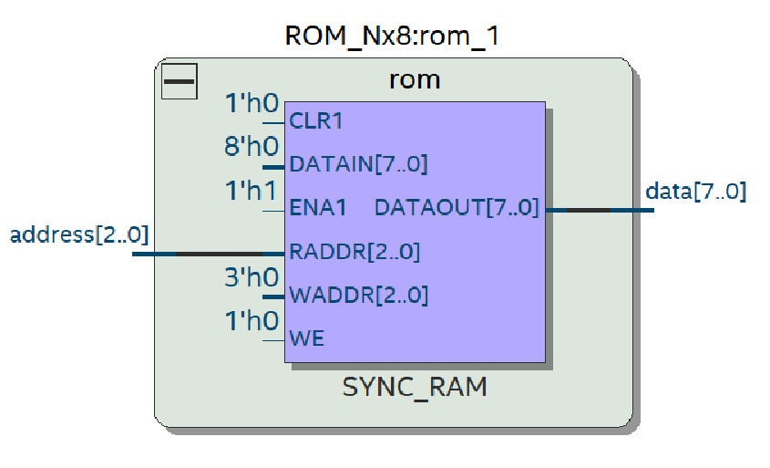

*Figure 1.6 — Program counter module Implementation*

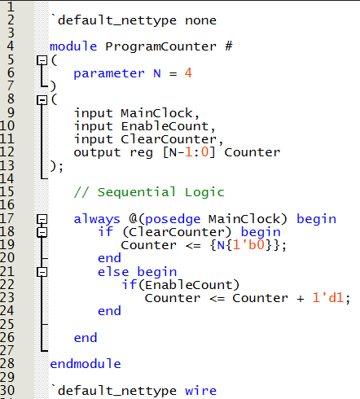

*Figure 1.7 — Program counter module RTL Viewer*

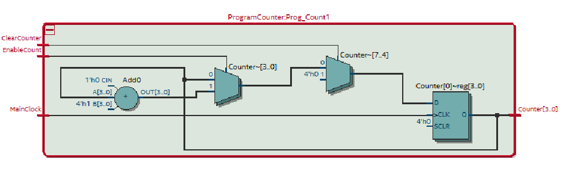

*Figure 1.8 — Accumulator A module Implementation*

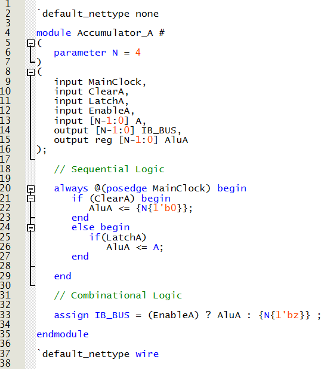

*Figure 1.9 — Accumulator A module RTL Viewer*

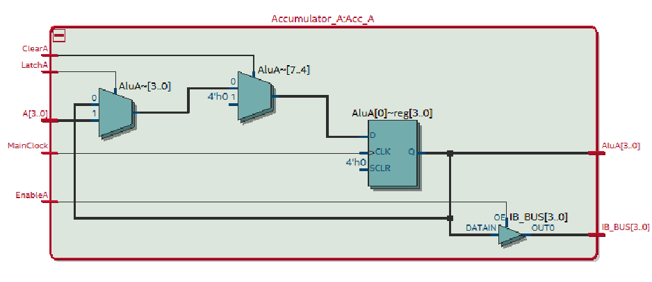

*Figure 1.10 — Accumulator B module Implementation*

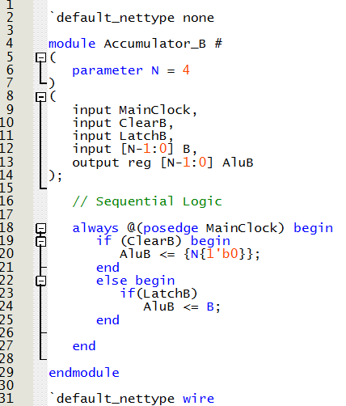

*Figure 1.11 — Accumulator B module RTL Viewer*

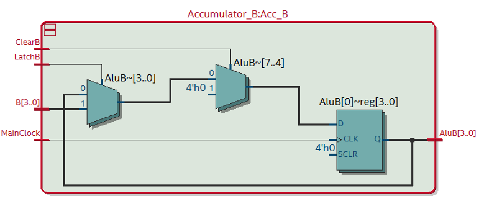

*Figure 1.12 — ALU module Implementation*

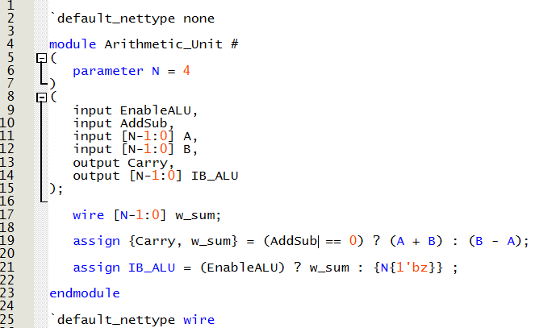

*Figure 1.13 — ALU module RTL Viewer*

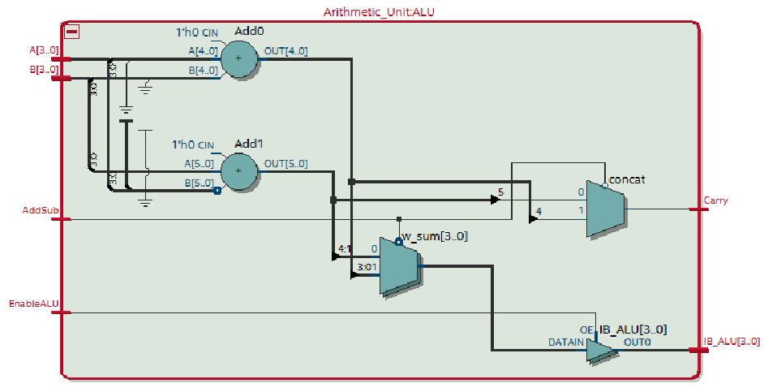

*Figure 1.14 — Input register module Implementation*

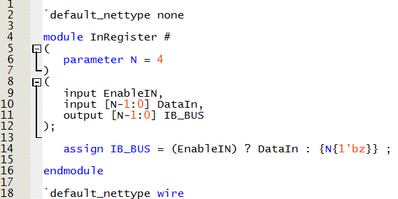

*Figure 1.15 — Input register module RTL Viewer*

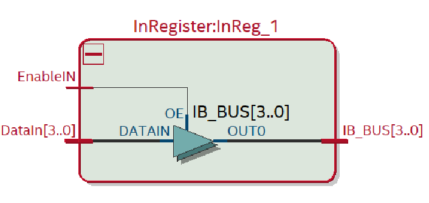

*Figure 1.16 — Output register module Implementation*

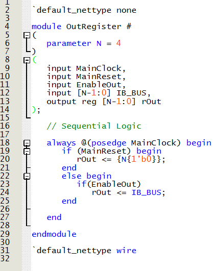

*Figure 1.17 — Output register module RTL Viewer*

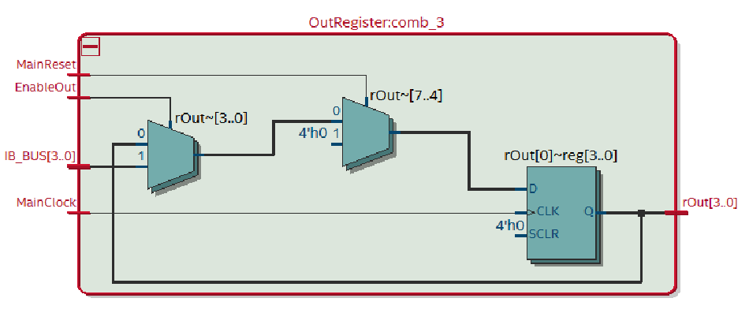

*Figure 1.18 — States of FSM module Implementation*

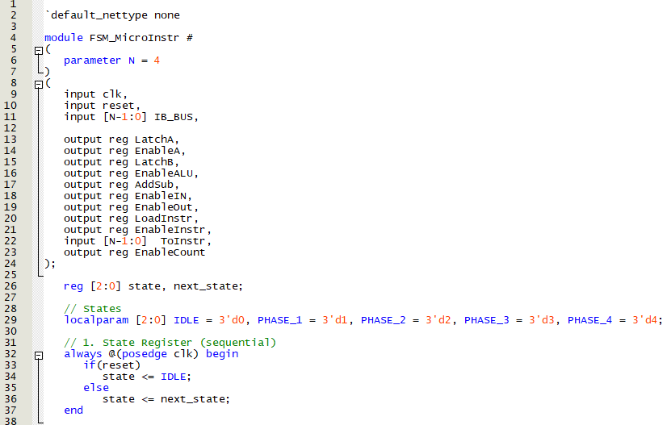

*Figure 1.19 — Next State logic of FSM module Implementation*

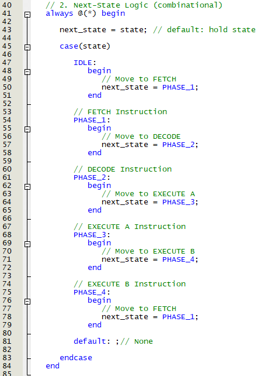

*Figure 1.20 — Output Phase 1 and 2 of FSM module Implementation*

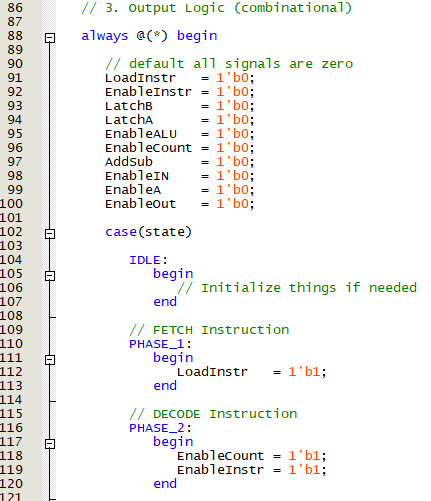

*Figure 1.21 — Output Phase 3 of FSM module Implementation*

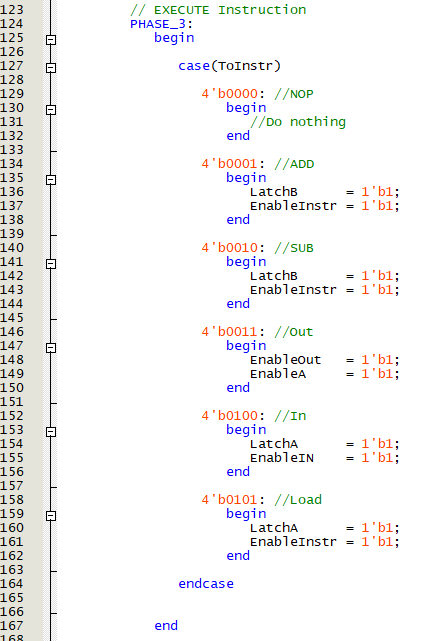

*Figure 1.22 — Output Phase 4 of FSM module Implementation*

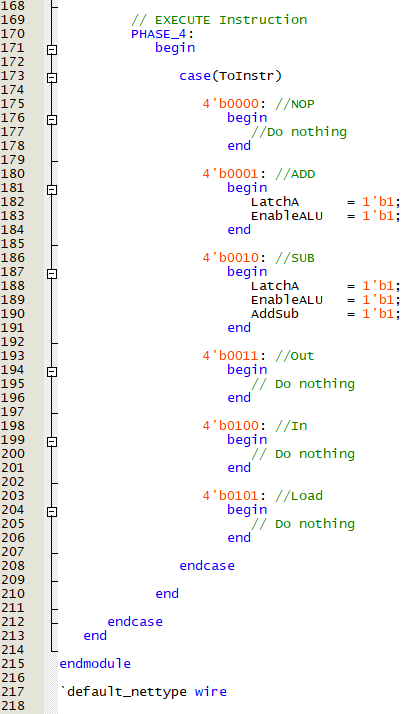

*Figure 1.23 — Wires of main module Implementation*

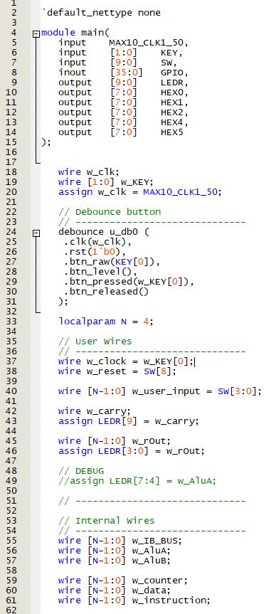

*Figure 1.24 — Wires of main module Implementation*

*Figure 1.25 — Acc and ALU of main module Implementation*

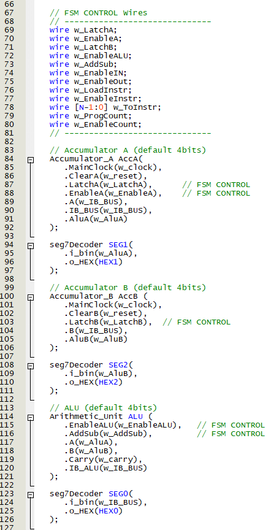

*Figure 1.26 — Input, Output, Instruction and counter of main module Implementation*

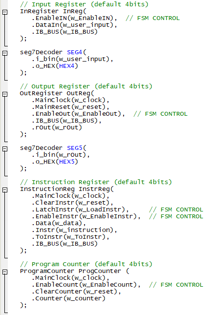

*Figure 1.27 — Memory and FSM of main module Implementation*

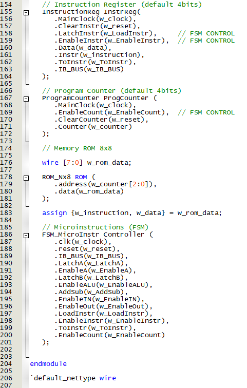

<h2 id="Demonstration1">Demonstration Part 1</h2>

*Figure 1.28 — VSM Demonstration*

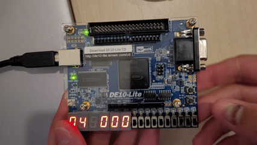

<h2 id="UART">UART Communication</h2>
For UART we reused the Async_transmitter and Async_receiver modules from previous labs. The transmitter exposes a busy flag (txD_busy) which prevents new writes while a frame is being transmitted. Incoming characters are echoed (ECO) immediately and given priority over other transmissions. When the VSM produces an output value, that value is converted from decimal to ASCII via the dec2char module before being passed to the transmitter.

*Figure 1.29 — Character decoder module Implementation*

*Figure 1.30 — UART module Implementation*

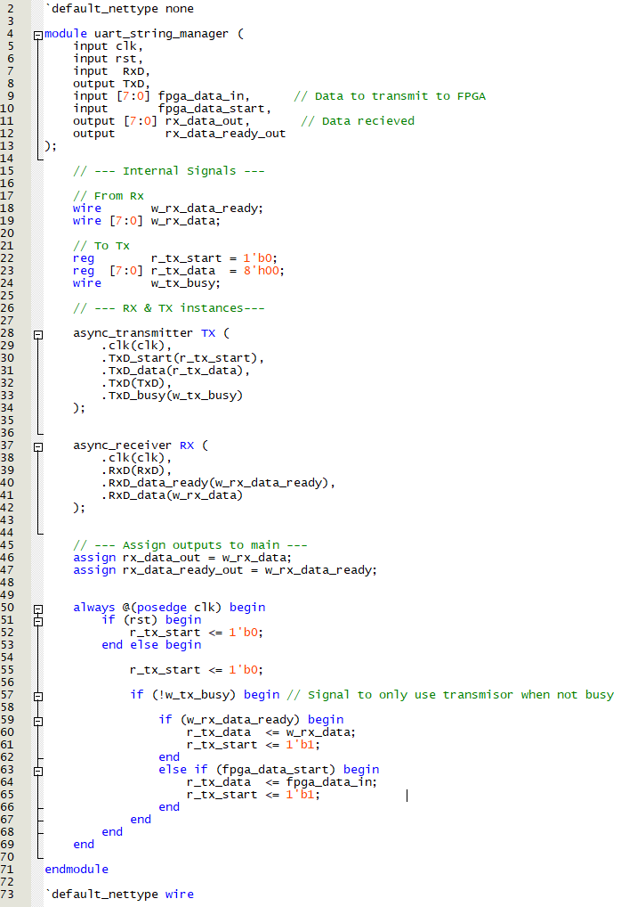

*Figure 1.31 — UART of main module Implementation*

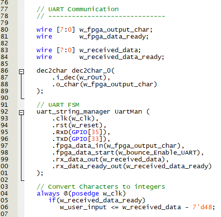

<h2 id="Demonstration2">Demonstration Part 2</h2>

*Figure 1.32 — VSM with UART Demonstration*

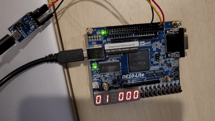

<h2 id="Future">Future Improvements</h2>

Display labeled messages over UART, e.g. <code>In - (&lt;value&gt;)\n</code> and <code>Out - (&lt;value&gt;)\n</code>, instead of raw digits only.

